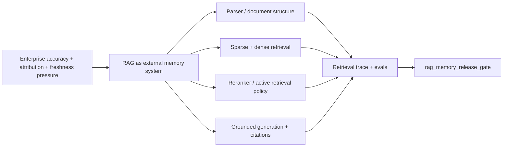

# CS25 - Retrieval Augmented Language Models

## Reading Status

Canon-ready direct read of the official Stanford CS25 recordings page, official CS25 V3 schedule description, the official public YouTube recording, the official YouTube transcript fetched directly from that recording on 2026-05-19, the original RAG paper by Douwe Kiela and coauthors, and current Contextual AI production RAG material. This note does not claim a full watched-video pass, does not store raw transcript text, and does not use third-party transcript mirrors or long excerpts.

This note is original synthesis only and does not include raw transcript text or long excerpts.

## Why This Matters

The CS25 retrieval lecture is a high-signal bridge between the research idea of retrieval-augmented generation and the production question Agent Studio has to answer: how should a multi-agent studio use external knowledge without trusting the base model's memory?

The official CS25 description frames the lecture around language-model shortcomings, retrieval augmentation as a solution, recent literature, and open questions. The original RAG paper makes the core mechanism explicit: combine parametric memory in the generator with non-parametric external memory retrieved at inference time. Contextual AI's later production writing pushes the idea further: robust RAG is a system, not a vector database bolted onto a black-box model.

## Concept Map

## Why The Lecture Still Matters In 2026

The transcript makes the motivation more operational than the papers alone. Kiela frames enterprise deployment pressure around three concrete failures: high-confidence hallucination, weak attribution, and stale knowledge. RAG matters because it moves those failures onto a governed subsystem where the index can be swapped, refreshed, and inspected instead of forcing the model weights to carry every update.

Agent Studio implication:

- Treat freshness, attribution, and evidence visibility as first-order product requirements, not post-hoc retrieval add-ons.
- Separate the model route from the knowledge route so one can refresh sources or indexes without pretending the model itself changed.

## Core Idea

RAG exists because language models have limits that matter in production:

- they cannot easily update world knowledge stored in parameters;
- they do not naturally expose provenance for answers;
- they can hallucinate when asked for precise knowledge;
- they may be expensive or ineffective if asked to carry all context in the prompt.

Retrieval augmentation changes the design center. The model is no longer the only knowledge store. A separate source/index layer can be updated, inspected, filtered, evaluated, and governed.

Agent Studio implication:

- Treat the vault, source registry, chunk/index store, and retrieval trace as product infrastructure.
- Do not present a grounded answer unless the system can identify the retrieved evidence and source lineage behind it.
- Prefer source-index updates for changing knowledge before considering model fine-tuning.

## Parametric And Non-Parametric Memory

The original RAG paper distinguishes:

- parametric memory: knowledge encoded in model weights;
- non-parametric memory: external documents retrieved from an index.

The production design lesson is that these memory types have different operational properties. Model weights are hard to inspect and update. External memory can be versioned, filtered, access-controlled, refreshed, deleted, cited, and audited.

Agent Studio implication:

- Store source-grounded knowledge outside prompts and model weights.
- Make retrieval index versions part of every agent release.
- When facts change, update the source/index and rerun evals rather than hoping a model route "knows" the new answer.

## Retrieval Is A Latent Decision

The RAG paper models retrieved documents as latent evidence that influences generation. Production systems make that latent step operationally visible: the user asks a query, the retriever selects candidates, the generator conditions on selected evidence, and the final answer should reflect what was retrieved.

Agent Studio implication:

- Retrieval decisions must be traceable: original query, query rewrite, filters, index, candidates, ranks, reranker scores, chosen context, rejected context, and citations.
- Retrieval failures and generation failures need separate diagnosis.
- Evaluation should score context recall/precision before scoring final prose.
- Add an explicit retrieval-budget policy: retrieve once, retrieve iteratively, or retrieve only when uncertainty or coverage checks say the first pass is insufficient.

## Sparse Retrieval Is Still The Baseline

The official transcript spends real time on tf-idf and BM25 rather than treating them as obsolete history. That is useful for vault design because it matches the kinds of queries humans actually run against notes and docs: exact source titles, rare terms, filenames, API names, and provenance lookups. Dense retrieval helps semantic matching, but sparse retrieval remains the most direct baseline for exact-match evidence recovery.

Agent Studio implication:

- Keep BM25-style lexical retrieval as a first-class lane for exact provenance and rare-token queries.
- Benchmark dense retrieval against a sparse baseline instead of assuming embeddings dominate by default.
- Record which retrieval family produced each accepted evidence item before reranking or synthesis.

## Frozen RAG Is Only The Starting Point

The transcript sharpens a point that production teams often blur: "RAG" is not one architecture. There is a train-time design question and a test-time design question. At train time, one must decide whether the language model stays fixed, whether only the query encoder changes, whether the document encoder changes, and what even counts as a retrievable document or chunk. At test time, one must decide which index to hit, how sampling or retrieval cadence works, and how the retriever and generator interact.

Agent Studio implication:

- Store retriever/generator coupling as explicit route metadata, not as an implementation detail.
- Treat `document_definition` as a release surface: full document, section, chunk, sentence window, or multimodal unit.
- Separate frozen-RAG routes from learned or jointly optimized routes in evals and rollback policy.

## Sequence-Level Versus Token-Level Evidence

The original RAG paper compares using the same retrieved documents for an entire generated sequence versus allowing evidence to vary across generated tokens. Modern production systems often implement this as a design tradeoff:

- stable evidence set: simpler, easier to cite, lower orchestration cost;
- dynamic retrieval: better for multi-hop, long, or evolving questions, but harder to audit and more expensive.

Agent Studio implication:

- Use stable evidence sets for most note synthesis, citations, and user-facing grounded answers.
- Use iterative/dynamic retrieval only when the task is explicitly multi-hop or the first retrieval pass is insufficient.
- If retrieval changes during an agent run, store each retrieval step and the reason it was triggered.

## RAG As A System, Not A Patch

Contextual AI's production writing argues that frozen, stitched-together RAG pipelines can be brittle because the parser, retriever, reranker, generator, prompts, and evaluator are optimized separately. Their RAG 2.0 framing emphasizes jointly optimizing retriever and generator for grounded domain work.

Agent Studio should not blindly adopt every vendor claim, but the architecture lesson is strong:

- end-to-end behavior matters more than any single component score;
- document parsing and hierarchy affect retrieval quality;
- reranking and grounded generation are part of the same reliability surface;
- production RAG needs deployment, evaluation, tuning, and maintenance paths.

Agent Studio implication:

- Optimize the full source-to-answer path, not just embeddings.
- Treat parser quality, section hierarchy, table extraction, chunk metadata, reranker behavior, and citation formatting as part of answer quality.
- Build eval suites that include complex local books, official docs, PDFs with tables, conflicting sources, and stale docs.

## RAG Versus Long Context

Long-context models are useful, but the transcript makes the efficiency argument especially clear: asking one question over a whole Harry Potter-sized context means paying to read an enormous haystack when most of the tokens are irrelevant. Kiela's further point is stronger than a simple cost argument: once long-context systems scale, they often move toward sparse or selective attention patterns that behave like retrieval behind the scenes. In practice, scalable long context and RAG are closer cousins than marketing language implies.

Agent Studio implication:

- Use long context when the task genuinely requires broad source reading or local reasoning over a bounded document.
- Use RAG when the corpus is large, frequently updated, access-controlled, or needs citation/provenance.
- Combine both for book work: direct-read sections deeply, but retrieve supporting notes and official docs for cross-checks.
- Do not let "million-token context" become an excuse to skip retrieval, ranking, or evidence selection discipline.

## Retrieval Timing Becomes Tool Policy

The transcript also pushes RAG toward an agentic framing: retrieval is one tool among several, and the model should ideally learn when retrieval is worth the compute budget instead of retrieving on every token or only once at the start. That suggests a route policy richer than static top-K search.

Agent Studio implication:

- Represent retrieval as a callable tool with a budget, trigger condition, and audit trail.
- Allow active retrieval loops when the answer surface is multi-hop, uncertain, or coverage-incomplete.
- Store why each additional retrieval step happened, not just the final evidence pack.

## Document Parsing Is Retrieval Quality

Contextual AI's parser writing is relevant to the CS25 lecture because it shows where production RAG often fails before retrieval starts. Complex documents contain hierarchy, tables, figures, captions, footnotes, and cross-page dependencies. Naive page-by-page or fixed-length parsing can destroy evidence.

Agent Studio implication:

- Preserve book chapter/section hierarchy and PDF page metadata.
- Use specialized extraction for tables, diagrams, code blocks, equations, and image-heavy PDFs.
- Store parser confidence or extraction warnings where available.
- Route low-confidence extraction to human review or a separate OCR/parser pass before synthesis.

## Failure Modes

- Treating RAG as "just vector search" and ignoring parsing, filtering, reranking, grounding, and evals.
- Leaving the retriever frozen while expecting it to behave as if it were optimized for the generator and task.
- Changing document encoders without recording the required reindexing, dual-index comparison, and rollback path.
- Using retrieved context as decoration while the model answers from prior belief.
- Failing to cite or expose the source lineage behind an answer.
- Over-retrieving and increasing latency/cost while lowering answer focus.
- Letting long-context capacity justify sloppy retrieval.
- Combining generated notes with primary sources in the same index without provenance controls.
- Optimizing only the retriever or only the generator and missing end-to-end failure.
- Using dynamic retrieval without traceability, making multi-hop answers impossible to audit.

## Agent Studio Design Decisions

- Make RAG a first-class subsystem with source registry, extraction, chunking, embedding, indexing, retrieval, reranking, context packing, generation, citation, and eval stages.
- Store retriever/generator coupling policy: frozen retriever, reranker-tuned retriever, query-encoder update, document-encoder update, joint retriever-generator training, or external-memory architecture.
- Treat index refresh cost as a release concern whenever the document encoder, chunking policy, corpus, or retrieval objective changes.
- Require a `retrieval_trace` for every source-grounded answer.
- Keep `primary_source`, `official_doc`, `local_book_note`, `lecture_note`, `generated_synthesis`, and `feedback_case` as separate provenance classes.
- Score retrieval quality separately from answer quality.
- Add document hierarchy fields to chunk metadata: source, chapter, section, page, heading path, figure/table marker, and extraction confidence where available.
- Use iterative retrieval only when the task profile calls for multi-hop or uncertainty-driven search.
- Prefer source/index refresh for factual updates; treat fine-tuning as a separate governed path.

## RAG Release Gate

Agent Studio should require a `rag_memory_release_gate` before a retrieval route can support production answers, canon synthesis, or route promotion. The gate should include:

- source snapshot and rights/freshness policy;
- retriever/generator coupling policy and frozen-versus-adapted component list;
- parser profile, extraction quality, document hierarchy, and table/figure handling;
- chunking policy, metadata fields, embedding model, index version, and access filters;
- index refresh/re-embedding requirement, dual-index comparison, and rollback target for encoder or corpus changes;
- first-stage retrieval mode, query rewrite policy, fusion policy, reranker policy, and context-packing policy;
- retrieval trace schema for original query, rewritten query, candidates, accepted evidence, rejected evidence, ranks, scores, and citations;
- separate retrieval, reranking, generation, and citation-validity evals;
- long-context comparison where broad source reading is a plausible alternative;
- fallback behavior when retrieval confidence, parser confidence, source rights, or freshness checks fail;
- rollback target for source/index/parser/reranker changes.

This gate prevents "RAG" from becoming a vague label. A route is only production RAG when the evidence path is inspectable and when failures can be assigned to parsing, indexing, retrieval, reranking, context assembly, generation, or citation validation.

## Remaining Work

- Optional future pass: directly watch the full official YouTube recording in Chrome or Browser if visual pacing, slide-sequencing, or emphasis cues become important. This note now uses the official public transcript, but that still does not replace a full-watch pass.
- Create transcript-backed or full-watch refreshes for adjacent CS25 lectures on generalist agents and state-space/transformer tradeoffs.

## Related Official Video Sources

This public Stanford Online video pointer is listed from the official CS25 recordings page and tracked in [[../../05-ingestion-runs/stanford-public-video-ingestion-status]]. The official public transcript was used directly on 2026-05-19 for a compact refresh, but no raw captions/transcript dump, comments, or long excerpts are stored, and no full-watch claim is made.

| Video | URL | Status |
|---|---|---|
| Stanford CS25: V3 I Retrieval Augmented Language Models | https://www.youtube.com/watch?v=mE7IDf2SmJg | official transcript used on 2026-05-19; full watch not completed |
