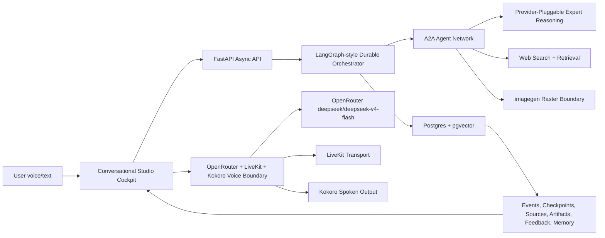

# HLD - Agent Studio System Design

## System Boundary

Agent Studio is a local-first conversational content studio. It is separate from this Obsidian design vault.

Product app includes:

- voice/text conversation,
- draft previews,
- source ledger,
- artifact browser,
- feedback controls,
- voice settings,
- run activity,
- memory policy status.

Run activity includes compact operational proof for active work, completed outcomes, and specialist tasks needing attention. Failed, blocked, and canceled A2A messages are shown as attention items with redacted summaries and a guarded `Queue and run` action backed by retry authorization plus message-targeted worker execution. The execution target is the retried message id and recipient agent, not the broad recipient inbox or default worker roster.

Live voice follow-up execution is also message-targeted, but it continues by lineage rather than by broad inbox routing. Persisted assistant voice completions and provider-failure events pass the exact follow-up message id into the worker cycle; the backend then follows only accepted child tasks created from processed lineage messages. This preserves voice-to-content and provider-recovery chains without letting older accepted same-recipient tasks steal the continuation.

Product app excludes:

- board-style project tracking,
- planning HTML,
- design-vault notes.

## High-Level Components

## Production Design Canon

The architecture follows the cross-source canon in [[../03-patterns/system-design/production-agent-studio-canon]]:

- Product objective first, model objective second.
- Product app and planning workspace are separate systems.
- Postgres + pgvector is the durable product state plane.
- Obsidian is the planning and design memory plane.
- Realtime audio is a transport and turn-taking layer, not the whole reasoning system.
- OpenRouter `deepseek/deepseek-v4-flash` is the default live-dialogue reasoning route; Hugging Face/Gemma/Gamma routes are legacy/source-background or optional non-default expert lanes, not current live-voice blockers.
- Retrieval quality is measured before generation quality is trusted.
- Feedback becomes typed product data before it becomes memory.

## Durable Data Plane

Postgres + pgvector is the durable product state plane. Object storage can hold binary payloads for source files, generated media, sandbox exports, batch manifests, eval outputs, and note artifacts, but the product truth remains in Postgres records that identify the object version, hash, rights, lineage, retention, lifecycle, and access events.

Local pgvector retrieval is still a governed retrieval subsystem. Embedding table schema, vector dimensions, vector type, distance operator class, exact-versus-approximate mode, HNSW/IVFFlat settings, query-time knobs, metadata filters, full-text-search fusion, precision/compression, and index maintenance can all change which sources are retrieved. These settings need release records and recall benchmarks before a retrieval route can be trusted.

Local retrieval promotion needs a release gate that binds the embedding table, source/chunk snapshot, ANN index, distance/operator-class policy, query-time knobs, rights/filter execution path, full-text search plan, fusion/rerank policy, precision policy, recall/latency benchmark, maintenance and restore evidence, exact-search fallback, and rollback target.

Contextual retrieval is a derived-artifact layer over chunks. Routes that prepend chunk-specific context before embedding or lexical indexing need a contextual retrieval release gate: source/chunk snapshot, contextualizer prompt/model/version, context hash policy, embedding and lexical indexing flags, hybrid/fusion/reranker policy, K experiment, prompt-cache evidence, dropped-evidence audit, retrieval evals, faithfulness evals, and rollback to raw chunks or the prior policy.

Vector retrieval still needs production release controls. Collection schema, named vector fields, sparse and multivector profiles, payload filter/index schema, quantization, aliases, snapshots, and partitioning policy are durable product behavior. A route that depends on a vector index should know the active alias, source snapshot, filter policy, quantization profile, snapshot/restore evidence, and rollback target.

Qdrant-style vector-store promotion needs a release gate that proves collection schema, source snapshot, vector fields, payload schema and indexes, required filters, hybrid query plan, multivector/quantization choices, alias and rollback pointer, snapshot/restore evidence, optimizer policy, partition policy, recall evals, latency/cost evals, and rollback target.

Managed vector providers add provider-level release controls. Agent Studio should know which managed index, ranking fields, namespace, metadata filter schema, hosted reranker, backup/import posture, usage units, and cost budget are attached to a retrieval route before that route is considered production-ready.

Managed-vector promotion needs a release gate that binds managed index schema, source snapshot, ranking fields, namespace/isolation policy, metadata filter schema, hybrid pattern and alpha/fusion evals, rerank policy where enabled, backup/restore or import evidence, usage/cost budget, relevance and latency evals, privacy boundary, and rollback target.

Named-vector retrieval needs target-level observability. A source object may have separate title, body, code, image, caption, or policy vectors; hybrid routes should preserve target name, target weights, keyword properties, alpha/fusion setting, required filters, tenant state, reranker/module binding, and backup evidence.

Named-vector retrieval promotion needs a release gate that binds collection schema release, source snapshot, named vector targets, multi-target query plan, hybrid alpha/fusion policy, filter execution strategy, tenant state, diversity policy, module/reranker binding, backup/restore evidence, relevance and latency evals, privacy boundary, and rollback target.

Search-engine retrieval needs analyzer and retriever-tree observability. Routes using Elasticsearch-style search should preserve semantic field profile, lexical analyzer profile, vector field refs, RRF or linear fusion parameters, semantic reranker endpoint, alias swap evidence, reindex validation, and snapshot/restore evidence.

Search-engine retrieval promotion needs a release gate that binds search index release, source snapshot, semantic field behavior, lexical analyzer settings, vector fields, retriever tree, fusion strategy, semantic reranker policy, alias release, reindex validation, snapshot/restore evidence, access boundary, relevance and latency evals, and rollback target.

Reranker providers need their own runtime contract. Hosted rerankers and local CrossEncoder fallbacks should preserve provider capability, candidate-pool size, output cutoff, rank fields, truncation behavior, usage units, latency, score movement, false-negative samples, privacy boundary, and fallback decision.

Reranked route promotion needs a release gate before scores affect final context packs. The gate should bind provider/local capability, route policy, candidate-pool and output settings, rank-field serialization, truncation behavior, privacy/retention posture, timeout/retry/quota/budget controls, local fallback or deterministic degradation, score snapshots, false-negative audit coverage, provider eval comparison, latency/cost evidence, and rollback target.

Hosted file search and web search need a separate release plane. Routes using provider-hosted vector stores or live web search should prove vector-store/file processing status, chunking release, metadata filters, ranking and score-threshold policy, result inclusion, domain filters, source-list/citation visibility, source-rights linkage, freshness policy, consistency grace window, retrieval evals, and rollback decision before source-grounded behavior is trusted.

GraphRAG needs its own index/query release plane. Source text units, entity/relationship/claim extraction, community detection, community reports, embeddings, BYO graph tables, query mode selection, prompt tuning, LLM cache/provider settings, DRIFT branch state, and question-generation policy should be versioned as graph artifacts rather than hidden inside a retriever.

GraphRAG route promotion needs a release gate that binds source snapshot, text-unit policy, graph index release, extraction run, community detection/report records, BYO graph validation where used, query-route mode policy, DRIFT branch policy, prompt versions, LLM cache/provider settings, graph eval cases, source-traceability policy, cost and latency evidence, and rollback target.

Durable records:

- runs,
- checkpoints,
- events,
- agent messages,
- source records,
- web source candidates, robots policy checks, web fetch records, canonical URL records, sitemap discovery records, source terms reviews, web source refresh policies, and bulk crawl snapshot refs,
- crawl projection records, source sample inspections, language filter results, PII masking events, content filter results, quality filter results, dedupe clusters, filter-stage counters, validation leakage checks, tokenization artifacts, pipeline runtime benchmarks, and source-filter pipeline release gates before filtering/dedupe/tokenization/embedding changes can affect retrieval, tuning, eval generation, or canon notes,
- ingestion runs,
- retrieval traces,
- route registry entries,
- agent releases,
- eval datasets and eval runs,
- ranking eval cases, relevance judgments, ranking list snapshots, ranking metric results, coverage/diversity metrics, online feedback metrics, and ranking-quality release gates for retrieval, reranking, memory-selection, source-priority, candidate-list, and recommendation surfaces.
- uncertainty signals, decision policies, decision outcomes, evidence-dependency edges, graph messages, failure hypotheses, and uncertainty-decision release gates for routes that act, abstain, escalate, publish, mutate state, reduce review, or promote candidates based on confidence.
- capacity diagnoses, regularization policies, numerical-stability records, long-context memory records, optimization diagnostics, and capacity-optimization release gates before model, route, context, memory, optimization, or regularization complexity increases.
- calibration records, route-complexity records, online-update records, belief-state snapshots, candidate-diversity metrics, graph-authority policies, manipulation checks, and adaptive-belief-state release gates before feedback, graph authority, personalization, memory scoring, ranking exposure, or hidden-state estimates change production behavior.
- approximate inference records, posterior approximations, distribution-shift records, structured-prediction records, graph-structure hypotheses, diversity-selection records, interpretability reviews, generative-process records, and approximation-shift release gates before uncertainty-bearing inference, shift monitoring, graph promotion, diversity selection, interpretability, or latent generative-process changes affect production behavior.
- transformer application route release gates before tokenizer, task-pipeline, QA/RAG split, generated-text metric, few-label adaptation, compression/deployment, or pretraining changes affect production; these gates bind task family, tokenization eval, context assembly, QA pipeline, generated metric caveats, deployment benchmark, compression record, few-label strategy, pretraining run, rights/privacy, fallback, and rollback.
- applied ML route release gates before bounded classic ML, feature-pipeline, threshold, class-imbalance, managed AI, OCR/moderation, or restricted visual capability changes affect production; these gates bind model artifact, fitted preprocessing, cost metric, class distribution, calibration, threshold policy, reviewer capacity, provider drift review, privacy/responsible-AI access, fallback, and rollback.
- implementation route release gates before scikit-learn pipelines, PyTorch support models, graph-ML support routes, or agent-eval environments affect production; these gates bind estimator pipeline, preprocessing fit state, training loop trace, model artifact identity, classical baseline, graph schema/features, eval environment fixtures/actions/success criteria, dependency locks, fallback, and rollback.
- preference pairs,
- serving profiles,
- claim records,
- source-claim evidence ledgers with support state, reference world, accepted/rejected evidence, caveats, verifier refs, and decision references,
- artifacts,
- artifact object refs, object storage policies, object version events, object lifecycle events, signed object access events, and restore drill records,
- artifact registry entries, artifact versions, experiment runs, dataset versions, prompt registry entries, index registry entries, lineage events, and registry aliases,
- feedback items,
- memory records,
- retrieval quality ledgers,
- realtime sessions.
- workflow executions, activity attempts, task queue contracts, worker registrations, retry policies, dead-letter records, and idempotency records.
- provider batch jobs, batch items, batch input manifests, batch result manifests, batch retention policies, batch admission records, and batch reconciliation runs for noninteractive provider inference.
- provider batch release gates for item identity, input/output hashes, privacy segmentation, retention/deletion, admission/quota, provider health, result reconciliation, partial failures, validation, downstream write policy, fallback, and rollback.
- model gateway records, route versions, virtual keys, provider route decisions, fallback chains, cache policies/events, provider constraints, gateway budget events, and canary records for provider routing and cost control.
- selection-assessment release gates before prompt, model, retriever, reranker, graph, or agent-route candidate promotion; these gates bind split labels, candidate selection runs, held-out or shadow assessment runs, resampling or bootstrap evidence, metric uncertainty, validation reuse and staleness, leakage checks, regression slices, fallback, and rollback.
- platform layer records, dev environment profiles, workflow orchestration profiles, compute capacity profiles, and ML platform component records.
- autoscaling policies, resource request/limit profiles, capacity quotas, admission classes, scale decisions, and saturation signals.
- workload identities, permission bindings, secret access records, tenant isolation boundaries, network policies, permission reviews, privilege-escalation risks, and infrastructure-isolation release gates.
- prompt cache policies, cache keys, cache usage, invalidation events, provider rate limits, usage budgets, and cost attribution.
- distributed-system assumptions, consistency contracts, replication topologies, quorum policies, linearizability boundaries, eventual-consistency policies, conflict-resolution policies, distributed transaction boundaries, delay-sensitivity records, and distributed data contract release gates for routes or data families whose correctness depends on replication, logs, projections, queues, caches, cross-entity workflows, or delayed state.
- schema compatibility policies, API contract versions, contract consumers, compatibility tests, schema migrations, deprecation notices, decoder compatibility records, and dual-write migration records.
- SLIs, SLOs, error budgets, burn-alert policies, alert events, degradation policies, reliability signals, incidents, postmortems, toil records, reliability release gates, and workflow reproducibility records.
- stakeholder requirements, governance release gates, fairness slice evals, label caveats, model-design tradeoff records, business value metrics, human-review burden evidence, incident feedback paths, and rollback targets before optimization or autonomy increases.
- route cards, feature/signal records, feature entities/views, materialization jobs, online serving state, offline point-in-time snapshots, feature quality monitors, data-quality contracts, validation runs/results, anomaly reports, validation actions, exception waivers, data-quality release gates, parity checks, sampled output logs, delayed outcome joins, MCP work-surface records, skill instruction versions, artifact render actions, explainability artifacts, governance adoption records, and platform lifecycle/work-surface gates for agent automation over local or product-embedded surfaces.
- feature parity release gates for routes, evals, retrievers, rerankers, schedulers, feedback learners, and publishing workflows that depend on reusable signals; these gates bind feature definitions to entity keys, event-time policy, transformation versions, offline/online stores, materialization freshness, point-in-time joins, leakage checks, monitors, fallback behavior, authorized discovery, affected consumers, and migration/deprecation evidence.
- document parser profiles, extraction jobs, page coverage, layout elements, table extraction records, document quality signals, layout-aware chunks, extraction fallback decisions, and document-ingestion release gates for PDF/JPEG/DOC/DOCX ingestion.
- source datasheets, model/provider cards, route cards, card review events, incident feedback links, risk register entries, and card projection release gates that prove card artifacts are current projections from durable source/model/route/eval/risk/incident records before production promotion.
- model-adaptation lifecycle release gates before finetuning, adapters, prompt/prefix tuning, distillation, self-hosting, or model-objective changes affect production routes; these gates bind observed behavior evidence, mechanism assumptions, source documentation, rights policy, contamination checks, tokenizer impact, objective family, rejected simpler interventions, capacity estimate, lifecycle cost, serving impact, fallback, and rollback.
- architecture-memory release gates before route architecture class, memory profile, tokenizer/resolution policy, context strategy, or SSM/hybrid/attention-only serving changes affect production; these gates bind selected/rejected architectures, memory evidence, workload-slice fit, prefill/decode/throughput/cache/cost measurements, source-recall and citation-faithfulness evals, realtime/tool-trace evals where relevant, retrieval/citation fallback, rollback, and incident feedback.
- pretraining-assumption release gates before model pretraining, reasoning-centric pretraining, retrieval-aware pretraining, curriculum growth, or hallucination/reference-world claims reduce route controls or justify adaptation; these gates bind exact model/source assumptions, data allocation, retrieval budget, source-ledger coverage, reference-world evals, objective/data caveats, contamination and rights checks, simpler route interventions, reasoning-failure diagnosis, product-slice regressions, fallback, and rollback.
- state-transition release gates before source, artifact, media, route-config, approval, eval, memory, graph, or publish-state mutations; these gates bind initial world state, dependency graph, affected objects, predicted state deltas, invalidated approvals/evals, stale dependencies, required refreshes, multimodal evidence where relevant, transition evals, forbidden side effects, observed outcome capture, rollback, and incident feedback.
- Hugging Face Hub repo records, model-card snapshots, dataset-card snapshots, gated/private access reviews, security scan records, dataset viewer inspections, benchmark result records, and leaderboard snapshots.
- Hugging Face Hub registry release gates that bind sourced models, datasets, benchmarks, and Spaces to exact repo revisions, artifact hashes, rights/access/security evidence, external benchmark provenance, route-specific evals, fallback, and rollback before production use.
- privacy processing activities, sensitive-data profiles, de-identification policies/events, provider data boundaries, retention policies, privacy subject requests, human-access audits, and privacy release gates before privacy-sensitive route promotion.
- observability project records, trace scores, eval dataset examples, prompt experiments, component eval targets, trace export policies, annotation queue items, and observability eval loop gates that bind trace/span coverage, evaluator calibration, offline experiments, online eval sampling, annotation feedback, dataset backfill, export/privacy policy, and route release decisions.
- annotation projects, annotation schema versions, task records, assignment policies, annotator profiles, pre-annotation suggestions, active-learning batches, weak-label sources, annotation responses, and annotation export manifests.
- feature flag definitions, flag variations, targeting rules, evaluation events, exposure events, guarded rollout records, release experiments, and flag debt records for runtime route-control decisions.
- human-agent collaboration sessions, collaboration process metrics, user-agency controls, preference perspectives, personalization boundaries, privacy-norm eval cases, privacy attack simulations, anthropomorphism risk records, and human-centered route release gates before collaborative, personalized, privacy-sensitive, social-facing, or high-agency routes ship.
- collaborative-agent topology release gates that bind task decomposition, selected and rejected topologies, coordination contracts, overhead/cost/error-propagation evidence, role contracts, candidate pools, critique/ranking traces, loop-stop policy, domain safety boundary, scenario eval rubrics, human expert gate, fallback, rollback, and incident feedback before multi-agent, debate, critique, ranking, evolution, planner/checker, or expert-collaboration routes replace simpler routes.
- publish routes, platform accounts, Instagram media containers, platform assets, post intents, post executions, compliance gates, platform rate-limit records, rollback records, and synthetic-media disclosure records.
- C2PA/content-credential manifest records, provenance ingredient edges, provenance validation events, watermark detection events, platform disclosure requirements, and provenance-loss events for generated media.
- provider media generation requests, parameter snapshots, async generation operations, output asset records, safety filter results, variant sets, retrieval events, and QA promotion gates for OpenAI/Gemini/Imagen/Veo-style image and video generation.
- ChatGPT app records, app tool descriptors, widget templates, bridge events, app state scopes, file authorization records, discovery eval cases, auth grants, and launch review records.
- Agent Builder workflow records, workflow node contracts, ChatKit integrations, ChatKit sessions, widget definitions, action events, thread items, and trace grades for product-embedded agent chat.
- Tool execution boundaries, computer-use environments, sandbox profiles, sandbox instances, sandbox file bindings, sandbox process runs, sandbox network/filesystem policies, artifact exports, recovery decisions, cleanup proof, computer-use action events, shell sessions, shell command events, text-editor action events, MCP connector policies, and MCP resource conversion events for high-authority local/browser/tool routes.

The web acquisition plane is a release-gated source-control layer before extraction or chunking. A web-derived source can become retrieval or canon evidence only after discovery provenance, intended user-agent robots policy, fetch/redirect/cache metadata, canonical and sitemap signals, source terms/rights review, extraction quality, privacy/PII handling, refresh policy, and bulk-crawl snapshot lineage are recorded and approved.

The NLP ingestion adapter plane controls low-level text transformations before retrieval or canon synthesis can trust them. An `nlp_ingestion_adapter_release_gate` should bind adapter profile, text-boundary records, normalization policy, grammar-extraction candidates, embedding compatibility decisions, RAG traces, runtime/dependency locks, model versions, PII/privacy review, boundary/extraction/retrieval evals, fallback, and rollback.

The external publishing plane treats platform posting as a governed side effect, not a model-output mode. A route can publish only after a publishing release gate binds platform account identity, credential scope, approved artifact/text/visibility/audience/disclosure/schedule, compliance or audit state, rate-limit admission, media/container readiness, idempotent execution, durable platform ID or manual-completion proof, postcondition monitoring, rollback/delete/private/correction path, and human approval.

The content-provenance plane gates generated media before the publishing gate can rely on it. Final exported artifacts need source and ingredient edges, C2PA/content-credential or missing-credential state, validation events, watermark creation/detection evidence, provenance-loss caveats after edit/export/transcode, platform disclosure requirements, sensitive-topic flags, rights and consent refs, reviewer approval, fallback/non-publish option, and rollback/delete/correction policy.

The provider media plane treats image and video generation as artifact production, not model text. A provider-media release gate should bind provider/model and endpoint currency, request schema version, parameter snapshots, input rights/consent, privacy class, async operation lifecycle, polling/webhook policy, retrieval events, output asset hashes, safety filter results, variant selection, visual/text-rendering evals, provenance/disclosure handoff, platform constraints, human approval, deprecation review, fallback route, and rollback target.

The generative media pipeline plane keeps local, open-model, editing, adapter, and audio routes reproducible before provider or publishing gates rely on them. A `generative_media_pipeline_release_gate` should bind model-card and license constraints, media pipeline traces, control/adaptor inputs, adaptation rights and validation, audio representation and voice consent, local runtime memory/latency feasibility, watermark/provenance decision, safety/rights review, human review, fallback, and rollback.

The generative model route plane separates model-family and bridge choices from artifact-pipeline settings. A `generative_model_route_release_gate` should bind generative model profile, representation path, diffusion sampler settings, multimodal bridge architecture, upsampler stages, attribute-binding/rendered-text/alignment evals, world-model simulation transfer checks, music/audio tokenization, nearest-training-neighbor originality review, rights, latency/quality tradeoffs, fallback, and rollback.

The GAN and synthetic-media control plane treats generator output, critic scores, latent controls, conditional generation, image translation, and synthetic data as governed evidence surfaces. A `gan_synthetic_media_release_gate` should bind GAN route profile, synthetic media lineage, generator/discriminator evals, mode-collapse and seed-sensitivity checks, latent interpolation traces, conditional-generation contracts, image-translation preservation and forbidden-change policy, adversarial-media evals, rights review, human review, fallback, and rollback.

The media embedding plane treats visual similarity and cross-modal retrieval as evidence-producing routes. A media-embedding release gate should bind objective/checkpoint/transform provenance, source snapshot, rights and privacy filters, positive/negative pair policy, hard negatives, robustness slices, task-surface evals, accepted/rejected candidate traces, embedding refresh lineage, stale-reference handling, fallback, and rollback before similarity scores drive source selection, edit references, duplicate detection, style matching, storyboard continuity, or rights decisions.

The region evidence plane treats detection, segmentation, masks, crop safety, edit targeting, and visual explanations as first-class product evidence. A region-evidence release gate should bind model/version/use scope, candidate sets, boxes, masks, frame refs, confidence and threshold policy, matching/suppression and postprocess policy, failure slices, edit/provenance refs, reviewer policy, fallback, rollback, and incident feedback before region evidence approves, rejects, edits, crops, moderates, or publishes an artifact.

The temporal video plane treats continuity, action, pacing, subtitle timing, and multimodal agreement as timestamped evidence, not whole-file impressions. A temporal-video release gate should bind clip-window and sampling policy, action/event records, object tracks, frame/region refs, audio/subtitle/OCR/transcript traces, modality-fusion and disagreement policy, temporal eval cases, fallback route, human review, provenance, rollback, and incident feedback before a video route claims publishing readiness or generated-video quality.

The spatial media plane treats 3D reconstruction, generated views, camera paths, product shots, scene consistency, and spatial edits as uncertain state estimates rather than proof from a single rendered frame. A spatial-media release gate should bind representation family, source views, masks/depth/pose cues, coordinate frame, scale policy, missing-view assumptions, known uncertainties, camera view records, render lineage, geometry/view claims, spatial consistency evals, staleness invalidation, fallback, rollback, and incident feedback before spatial media affects approval, publishing, or source evidence.

The vision-language grounding plane treats captions, VQA answers, alt text, image-text retrieval, OCR/text visual QA, and visual source claims as evidence-producing records. A vision-language grounding release gate should bind the task prompt or question, expected answer type, allowed inference level, input/source snapshot, region/mask/frame/object-track refs, visible versus inferred versus source-backed claim split, caption artifacts, unsupported-claim flags, VQA traces, cross-modal retrieval candidate traces, source-evidence refs, forbidden-inference policy, grounding evals, fallback, rollback, and incident feedback before visual language can approve, reject, publish, or mutate source evidence.

## Reliability Plane

Agent Studio reliability covers user-visible behavior and operational health:

- route success and artifact durability;
- retrieval coverage and source freshness;
- realtime voice timing and interruption behavior;
- provider latency, throttling, and fallback;
- ingestion freshness and reproducibility;
- eval execution and regression gates;
- eval release gates that bind success contracts, datasets/splits, grader calibration, trace coverage, baseline/candidate comparisons, failure slices, cost/latency thresholds, reviewer overrides, and rollback conditions;
- RAG/agent eval release gates that bind context precision, context recall, faithfulness, tool-call correctness, goal-outcome evidence, evaluator versions, span coverage, failure-slice regression state, and online-to-offline feedback promotion;
- RAG-agent-reasoning release gates that bind source authorization, retrieval/rerank evidence, packed context, citation validation, tool/action boundaries, execution owner, task/eval environments, agent data lineage, reasoning traces, verifier strategy, test-time compute budget, long-context controls, human-review burden, cost/latency, failure slices, fallback, and rollback;
- transformer-context release gates that bind model architecture assumptions, attention/position/masking/tokenization policy, ordered context assembly, segment trust labels, source-grounding boundaries, retrieval traces, accepted/rejected evidence, claim support, far-context and distractor evals, truncation failures, prefill/decode/KV-cache/batch/memory/retrieval-latency evidence, cache privacy scope, fallback, rollback, and human approval;
- knowledge-allocation release gates that bind knowledge subject, freshness, rights, citation requirement, volatility, chosen memory location, generalization requirement, context-versus-weight rationale, lighter interventions tried, latent generalization evals, retrieval-as-memory requirement, adaptation proposal, capacity estimate, serving impact, grounding/source-diversity/safety/style/latency/cost regressions, fallback, rollback, and human approval;
- preference-alignment release gates that bind baseline and candidate route, reference policy, rejected lighter interventions, method choice, preference dataset provenance and rights, pair-quality checks, evaluator/judge identity, reward-type separation, verifier scope, behavior/style drift, reward-overoptimization checks, fixed alignment regression slices, grounding/safety/source-diversity/latency/cost evals, human-review burden, blocked tradeoffs, rollback route, incident feedback path, and human approval;
- open-model post-training release gates that bind base-model identity, license/terms, architecture and context assumptions, training disclosures, deployment constraints, post-training recipe, prompt/task curation, demonstrations, preference data, reward/verifier method, SFT/DPO/RLHF/RLVR settings, eval suite, released artifacts, capability slices, reward-model/judge/verifier evals, decontamination, negative results, behavior regressions, fallback, rollback, incident feedback, and human approval;
- reward/reasoning/world-model release gates that bind task condition, reward specification, reward type separation, blind spots, verifier scope, test-time compute policy and score/cost/latency curves, long-horizon eval budget, world-model state schema, transition model, coverage evidence, uncertainty policy, simulation exploit checks, feedback reuse boundary, side-effect policy, fallback, rollback, and human review;
- incident learning and route rollback.
- toil reduction for repeated manual fixes and operator interrupts.

Every production route needs a degradation path. A failed provider, stale source, retrieval outage, queue spike, or voice stack failure should move the product into a known reduced mode instead of silently producing lower-quality work.

Every production route also needs user-visible SLIs before SLOs are chosen. For this product, correctness, source coverage, freshness, artifact durability, publish safety, voice turn timing, and feedback-save durability are reliability surfaces. Error-budget burn should drive route freezes and reliability work; alerts should become pages only when immediate human action is required.

Reliability exceptions should be explicit release artifacts, not informal permission to keep shipping. Each exception needs a reviewer, scope, expiry, compensating control, and linked corrective work before a route can proceed while its quality, freshness, latency, durability, safety, or publishing budget is burned.

Every external dependency also needs a resource-control contract: timeout, retry budget, backoff, jitter, idempotency, dependency-isolation pool, and load-shedding behavior. Realtime, batch ingestion, evals, MCP/browser tools, media generation, and expert inference should not share one unbounded pool.

Dependency resilience is a route-release gate. The system should reject promotion when timeout ownership, retry location, total deadline, idempotency, isolation pool, degraded mode, and fault-injection evidence are missing for provider calls, retrieval, publishing, browser/computer-use, MCP, OCR/layout, media generation, or realtime sessions.

Every durable event family also needs an event-ledger contract: partition key, ordering scope, retention or compaction policy, schema version, consumer cursor state, delivery semantics, and replay drill. Cockpit state should be a rebuildable projection from events, not hidden mutable state that only works until a worker restarts.

Event-ledger promotion should require schema compatibility, decoder checks, consumer cursor ownership, idempotent sink policy, projection rebuild comparison, partition-key hot-spot review, compaction boundary review, and outbox or transaction coordination for Postgres-backed writes.

The Postgres durable plane also needs database-level proof: transaction consistency policies for critical write paths, serialization retry boundaries, WAL and synchronous-commit posture, PITR restore drills, replica freshness rules, and logical-decoding/outbox duplicate handling. A standby or CDC stream should not be treated as current product truth unless its lag and failover behavior are known.

Critical write paths need a durable-state release gate before promotion. The gate should bind transaction policy, invariant checks, WAL/PITR posture, restore-drill evidence, replica-read eligibility, logical-decoding or outbox duplicate handling, event/projection coordination, and migration evidence into one route-release decision.

The async execution plane needs its own release contract. Long-running routes should use replayable workflow state for orchestration, while side effects run as activities or jobs behind workload-specific queues. Each queue needs declared worker types, rate and concurrency limits, retry policy, timeout or visibility lease, DLQ/quarantine behavior, idempotency key handling, and queue health metrics before it can carry production work.

Queue existence is insufficient evidence. Promotion should require a background-lane release gate that proves deterministic workflow state, side-effect activity boundaries, worker-version compatibility, ordering scope, duplicate handling, replay drill, redrive drill, and quarantine review before any lane can mutate artifacts, memory, source indexes, publishing state, or user-visible notifications.

The capacity plane must protect user-visible routes from background work. Realtime, foreground conversation, source ingestion, evals, media generation, and maintenance need separate autoscaling targets, resource requests/limits, quotas, admission classes, and overload decisions. Scaling should be driven by workload pressure such as queue age, ongoing requests, TTFT/TPOT, GPU/KV pressure, and saturation signals, not by CPU alone.

Serving and worker lanes should pass a capacity release gate before promotion. The gate should bind autoscaling policy, resource request/limit profile, quota boundary, admission class, saturation signals, scale-decision telemetry, and queue/workflow compatibility so scaling out does not break ordering, idempotency, provider quotas, or source-rights constraints.

Served model routes need a workload-level gate before engine-specific optimization. An `inference_workload_release_gate` should bind workload class, input/output length distributions, concurrency, streaming and queueing assumptions, SLO, phase measurements, runtime/provider, GPU or accelerator choice, precision/quantization, cold-start evidence, endpoint contract, representative benchmarks, quality/grounding/safety regression checks, background-starvation behavior, fallback, and rollback.

Dedicated LLM serving has a separate topology plane. If Agent Studio adopts self-hosted or dedicated engines for ingestion, eval, RAG, or realtime-adjacent routes, the route should declare whether serving is aggregated, disaggregated prefill/decode, KV-aware routed, cache-offloaded, or a fallback topology. Promotion should require a `serving_feature_stack_release_gate` with measured prefill/decode/cache pressure, feature compatibility, dynamic endpoint/router-state assumptions, backend feature support, KV-event fallback behavior, queue/priority policy, scale-down safety for in-flight requests, benchmark deltas, quality regressions, overload behavior, and rollback to a simpler topology.

vLLM-backed serving needs runtime-specific release evidence. An OpenAI-shaped endpoint can still differ by supported API family, unsupported parameters, extra vLLM parameters, tokenizer/chat-template assumptions, generation-config defaults, batching, KV cache behavior, prefix caching, quantization, speculative decoding, disaggregated prefill topology, and metrics. A vLLM serving release gate should bind endpoint contract, model/tokenizer/chat-template snapshot, generation-config policy, engine/server argument snapshots, batching and KV/PagedAttention behavior, prefix-cache boundary, quantization/KV dtype, speculative decoding profile, disaggregated-prefill topology, compatibility matrix, workload benchmarks, metric snapshots, quality/source-grounding deltas, capacity/admission policy, fallback mode, and rollback target.

Ray Serve-backed serving needs serving-platform release evidence above the inference engine. Agent Studio should preserve Serve application identity, deployment graph/config version, endpoint contract, RayService or VM deployment status, Serve autoscaling, cluster autoscaling/resource placement, model/adaptor multiplexing, adapter provenance/evals, engine contract, OpenAI-compatible smoke tests, health/status evidence, load-test slices, metrics/observability wiring, upgrade strategy, fallback route, and rollback target.

TGI-backed serving should be treated as a legacy or exception-path runtime because the current Hugging Face Inference Endpoints docs mark TGI as maintenance mode and recommend vLLM or SGLang alternatives. If Agent Studio uses TGI, release evidence should prove adoption or migration justification, model/container revision, endpoint compatibility, token and batch limits, scheduler/continuous-batching policy, KV/cache admission behavior, prefix-cache boundary, quantization/KV dtype/speculation settings, launcher argument snapshot, phase-level metrics, workload benchmark, quality/source-grounding deltas, autoscaling/admission policy, observability wiring, fallback to vLLM/SGLang/managed endpoint where appropriate, and rollback target.

The platform plane must keep infrastructure layers visible instead of collapsing everything into ad hoc scripts. Storage, compute, development environments, workflow schedulers, service orchestrators, model/source/prompt/index registries, eval stores, trace stores, and UI projections need explicit ownership, reproducibility metadata, failure boundaries, monitoring hooks, and rollback paths.

Agent Studio now treats the local always-on worker scheduler as supervised platform infrastructure rather than a hidden CLI side effect. The product app can start and stop a run-scoped scheduler process, but the process contract still belongs to the platform plane: status, pid, run scope, execution mode, cadence, profile cap, sanitized logs, and restart policy must be visible without turning the creator surface into a project-management board.

Platform dependencies need their own release gate before they carry production ingestion, eval, retrieval, serving, or publishing work. A `platform_infrastructure_release_gate` should bind layer ownership, environment profile, scheduler/workflow contract, service-orchestration contract, compute/cost evidence, deployment mode, registry lineage, monitoring/experimentation/business-measurement hooks, tool-fit review, data-security posture, lock-in or exit path, operational burden, fallback, and rollback.

Event-driven agent and RAG workflows need durable event evidence before production trust. A route that relies on workflow steps, context state, streaming events, HITL waits, multi-agent handoffs, corrective RAG, or framework callbacks should preserve typed event schemas, workflow step contracts, context snapshots, checkpoint/resume state, wait/response records, multi-agent pattern decisions, retrieval relevance evals, response faithfulness evals, trace callbacks, side-effect policy, and rollback condition.

Load shedding is part of the capacity plane, not a last-minute exception. Each lane needs criticality tags, success and failure buffers, lane-local CPU or latency saturation signals, retry-after behavior, and a tested rule that sheds/defer low-priority work before critical user-visible state changes fail.

Overload behavior should be release-gated for mutation-capable and user-visible lanes. Foreground conversation, source-rights decisions, artifact saves, approval gates, feedback writes, route releases, and publishing state need protected capacity and tested survival behavior before background ingestion, eval sweeps, media jobs, or tool stalls are allowed to compete with them.

The security isolation plane must back prompt/tool policy with actual privilege separation. Routes that touch private sources, credentials, browser/computer-use, publishing, or remote mutation need distinct workload identities, least-privilege permission bindings, scoped secret access, tenant/workspace boundaries, and explicit network reachability. A route is not contained if it runs with broad shared credentials.

Privileged runtime promotion needs an infrastructure-isolation release gate before autonomy increases. The gate should bind workload identity, RBAC permissions, escalation-risk review, secret-access contracts, tenant/workspace boundary, network policy and enforcement evidence, pod/runtime security posture, audit logs, permission-review cadence, and revoke/rollback plan.

The cache and cost-control plane must keep repeated work cheap without hiding stale or unauthorized evidence. Prompt caches, CDN/application caches, and low-priority batch/flex routes need scope-aware keys, invalidation triggers, provider rate-limit telemetry, usage budgets, and cost attribution. Cache, prompt-prefix, provider-limit, or low-priority processing changes need a cache-cost release gate before they can affect production routes. Source-backed correctness and rights freshness outrank cache hit rate.

The distributed data plane must make consistency a product contract rather than a database assumption. Run timelines, approvals, source-rights decisions, route releases, artifact revisions, feedback, memory, and publishing all need explicit ordering scope, stale-read tolerance, replication/freshness expectations, conflict-resolution policy, and transaction or saga boundary. Realtime paths can trade coordination for interruption speed; rights, release, billing, and publishing paths should pay the coordination cost.

The schema and API evolution plane must protect stored history and active consumers. Event families, route APIs, provider adapters, agent cards, MCP/A2A envelopes, tool schemas, checkpoint state, source-ledger records, eval datasets, and memory records need versioned contracts, declared backward/forward/full compatibility posture, registered consumers, decoder compatibility evidence, deprecation windows, and migration or dual-write plans before incompatible behavior ships. A compatibility release gate should block changes until compatibility tests, historical fixtures, consumer migration status, served/storage version posture, deprecation notices, and rollback or bridge strategy are linked to the release.

The registry and lineage plane must make every reusable asset reconstructible. Prompts, tool schemas, agent graphs, provider/model routes, source snapshots, extraction outputs, chunking profiles, indexes, eval suites, generated media, and route releases need immutable versions, mutable aliases with audit, producing run metadata, input/output lineage, validation state, and rollback eligibility. A registry-lineage release gate should block promotion until the release bundle can be reconstructed from immutable artifact versions, lineage events, producer runs, validation records, and alias assignment history.

The prompted-component release plane must keep GenAI application behavior versioned as a unit. Prompt template, examples, model/provider route, grounding snapshot, chain definition, tools, safety policy, retrieval/graph indexes, eval suite, CI/CD evidence, final-response evals, trajectory evals, cost/latency checks, and rollback target need one promotion decision. RAG and GraphRAG routes also need separate ingestion and serving readiness so an index refresh or graph-extraction change cannot silently bypass serving-route evaluation.

The LLM application route plane should treat a product capability as a shipped loop rather than a prompt. Each route needs product objective, target user or surface, deployment mode, compiled context assembly, instruction layers, trust labels, retrieval/memory/upload/tool segments, generation parameters, token-budget policy, eviction or compression policy, re-retrieval path, topology decision, rejected simpler alternatives, tool schemas, execution owner, state and memory policy, feedback flywheel, observability metrics, success metrics, realtime lane evidence where applicable, guardrail evidence, human approval, fallback, and rollback.

The agent environment and planning plane decides whether a route should be agentic at all. Before autonomy replaces deterministic workflow, fixed retrieval, or human-reviewed routing, the release should bind task-environment classification, performance measures, blocked tradeoffs, sensor/percept channels, actuator/tool channels, model/memory/tool architecture, action preconditions and effects, abstract plan/refinement policy, contingency branches, replanning policy, information-gathering value/cost rationale, partial-observability and reward-hacking evals, human review boundary, fallback, and rollback.

The object artifact plane must protect binary replayability separately from metadata durability. Source PDFs, JPEGs, DOC/DOCX conversions, generated videos/images/audio, code-sandbox exports, batch files, eval outputs, and trace attachments need object-version or generation refs, content hashes, retention/immutability state, lifecycle tier/expiration policy, signed-access issuance records, and restore-drill evidence before a route claims auditability or rollback. An object-artifact release gate should bind those storage facts to the route, eval, note, approval, or publication record that depends on the bytes.

The annotation data plane must treat feedback as structured supervision. Reviewer guidelines, question schemas, label/rating/ranking/span/text formats, pre-annotation suggestions, active-learning selection, weak-label sources, drafts, submitted responses, disagreements, exports, and dataset-promotion status need durable records before feedback can drive evals, tuning, source-quality filters, or route changes.

An annotation data release gate should block feedback-derived eval, tuning, source-filter, retriever/ranker, or route-release changes until the project identity, schema and guideline versions, assignment policy, reviewer classes, suggestion lineage and visibility, active-learning or weak-label provenance, export/storage manifests, disagreement review, draft/discard filters, dataset-promotion policy, selection-bias caveats, downstream-use policy, and rollback target are linked to the release.

The data-and-alignment plane must make source filtering, source mixtures, synthetic/post-training data, feedback, preference data, and verifier rewards auditable before they change route behavior. A `data_alignment_release_gate` should bind provenance and rights, extraction-loss risks, accepted/rejected counters, dedupe policy, mixture weights and reuse caps, teacher/judge/reviewer/verifier provenance, task-source and execution-availability metadata, reward-type separation, reward blind spots, decontamination, grounding/citation/source-diversity/safety/tool/style/latency/cost evals, baseline and candidate route, rejected lighter interventions, capacity estimate, serving impact, fallback, rollback, incident feedback path, and human approval.

The first-pass review plane should improve artifacts before expensive human review without becoming the approval authority. Route proposals, ingestion plans, publishing packets, PRDs, and release candidates need reviewer artifacts, access-bounded context bundles, prior-experiment/policy/metric/dependency retrieval, risk-classified review depth, fixed readiness dimensions, critical gaps, ordered repair actions, evidence refs, human-authority boundaries, override policy, post-review outcome tracking, and fallback manual review before reviewer output can influence release or canon decisions.

The release-control plane must treat feature flags as governed route behavior. Release, experiment, operational, kill-switch, permission, and config flags need owners, safe defaults, evaluation-context policy, targeting and variant definitions, exposure events, metric joins, guarded rollout decisions, and cleanup due dates before they can change models, retrievers, tools, memory, guardrails, publishing authority, or provider routing. A release-control gate should block runtime-controlled route changes until flag definitions, fallback behavior, context/privacy policy, exposure/outcome joins, rollback or pause state, tested kill-switch behavior, and stale-flag cleanup are linked to the route release.

The serving-rollout plane must separate readiness from promotion. Model-serving routes need candidate and baseline revisions, deployment mode, canary split, latest ready revision, latest rolled-out revision, previous known-good rollback target, health gates, runtime metric contract, autoscaling/cold-start evidence, graph-route branch evals where applicable, promotion event, and rollback condition before production traffic moves.

The guardrail plane must treat safety checks as boundary-specific release artifacts. Input guardrails, output guardrails, function-tool guardrails, hosted-tool caveats, handoff caveats, MCP/browser/computer-use approvals, tripwire behavior, recovery actions, and trace-grade coverage need separate records. A guardrail release gate should block guardrail-policy changes until boundary coverage, execution mode, side-effect ordering, eval coverage, and approval fallback are explicit.

The governance plane must prevent average-quality wins from hiding product harm. Route releases need stakeholder requirements, non-accuracy objectives, business/user value metrics, reviewer-capacity assumptions, fairness/coverage slice evidence, missing-label caveats, and model-design tradeoff records before optimization, provider substitution, compression, quantization, or autonomy increases.

The work-surface plane must keep agents close to authoritative artifacts without leaking private context. Obsidian, Figma, browser, filesystem, social-draft, and publishing surfaces need MCP-style capability snapshots, local/private data boundaries, versioned skills, constrained render/write actions, validation checks, and rollback evidence before an agent can mutate them.

The MCP connector plane should be explicit before any work surface is model-visible. MCP servers need protocol-version pins, lifecycle/capability snapshots, schema-dialect support, stdio or Streamable HTTP transport policy, session/resume/cancel state, OAuth/protected-resource metadata where HTTP authorization is used, resource/tool/prompt separation, list-change drift handling, human approval policy, output validation, timeout/retry policy, retention review, and rollback. Local vault/source reads should usually be MCP resources; browser, filesystem, publishing, paid, or credentialed operations are MCP tools behind high-authority gates.

The ChatGPT app plane is a distribution route over MCP plus host-rendered UI. Before a route ships as an app, the release evidence should bind MCP server identity, app record, tool descriptor versions, output schemas, widget templates, CSP/network review, structured-content versus `_meta` boundary tests, bridge-event coverage, state scopes, file authorization, auth grants, discovery evals, handler tests, UX/mobile screenshots, privacy/retention review, dependency review, submission status, fallback behavior, and rollback target.

The product-chat plane treats embedded chat as a versioned workflow plus product session, not a generic chat widget. A product-chat release gate should bind workflow snapshot, node/edge contracts, preview traces, trace graders, ChatKit integration mode, backend session endpoint, authenticated user/workspace binding, client-secret expiry posture, widget definitions, action schemas, validation/auth/idempotency tests, thread item lineage, UI/mobile tests, support handoff, fallback behavior, and rollback target.

The high-authority tool plane must treat computer use, shell, text-editor, remote MCP, browser, and external-mutation tools as release-gated capabilities. Execution owner, sandbox, network allowlist, credential scope, user consent, approval policy, prompt-injection trace evals, trace redaction, retention review, MCP connector policy, and cleanup/rollback proof should be present before these tools run against private sources or production accounts.

The code-execution plane must treat model-written code as a proposal until sandbox execution is approved and audited. Code-capable routes need sandbox profile, concrete instance policy, file bindings, process-run policy, network and filesystem boundaries, secret and package policies, artifact-export policy, recovery decisions, cleanup proof, validation/eval evidence, and rollback condition before generated files, source transformations, eval outputs, or note artifacts can become durable evidence.

The privileged-agent security plane must define who controls the agent, what powers it has, and how actions are observed before autonomy increases. A privileged route needs a controller record, authority scope, policy enforcement points, runtime safety scan policy, action-observation coverage, approval edges, user/researcher report channel, incident-to-eval backfill, and rollback condition. Runtime scanners such as Model Armor-style prompt/response/document checks are defense-in-depth; they do not replace least privilege, gateway enforcement, or human approval for external side effects.

The provider runtime plane must preserve provider-native state without making it the source of truth. Responses-style provider IDs, previous-response links, conversations, background jobs, streaming events, hosted tools, function calls, MCP imports, and tool outputs should map into local response/item/lifecycle records. A provider runtime release gate should block promotion until local audit/replay fallback, store/retention policy, background lifecycle handling, streaming finalization, tool/MCP snapshots, strict-schema tests, approvals, and rollback behavior are explicit.

The provider readiness plane must prove the account and operating boundary before traffic scales. Routes using OpenAI or similar APIs need provider project/billing boundary, API-key scope and storage posture, usage cap and alert threshold, safety identifier policy, applicable safety checks, rate-limit bucket and headroom, quota-aware retry/backoff, latency/cost strategy, background/realtime classification, user-reporting loop, fallback path, and rollback target before external publishing, high-volume automation, or user-facing production traffic is enabled.

Local provider credentials should prefer ignored secret files over tracked environment files. Agent Studio defaults to `.secrets/hf_token` and `.secrets/tavily_api_key`, reports only non-secret source status in provider readiness, and treats direct environment values as explicit overrides. Documentation may be allowlisted, but token/key files must remain ignored.

The model-gateway plane must make provider routing observable before it becomes product behavior. Gateway-backed routes need requested alias, selected model/provider/endpoint, route version, virtual-key scope, provider constraints, fallback chain, cache policy, budget/rate-limit policy, canary/eval evidence, privacy/data-retention posture, log redaction, degradation behavior, and rollback target before scale-up.

The A2A handoff plane should make specialist invocation durable before it becomes public protocol exposure. Internal and remote agents need Agent Card records, card freshness/hash evidence, selected skills, task/context IDs, typed artifact parts, stream subscriptions, push-notification/webhook policy, cancellation semantics, auth/security scheme, idempotency key, resume eligibility, terminal-state handling, and fallback. A public `/.well-known/agent-card.json` is optional for V1; the ledger shape is not.

Agent Studio now exposes a pragmatic public discovery adapter without overstating protocol support: `/.well-known/agent-card.json` advertises the local studio orchestrator, project skill set, and HTTP+JSON route root, while `x-agentStudio.fullA2AProtocolServer=false` preserves the distinction between A2A-shaped discovery and a full public JSON-RPC A2A server. This lets external tooling discover the local capability envelope while durable internal AgentMessage, worker-cycle, retry, dependency-repair, and collaboration-graph routes remain the source of execution truth. The public card should advertise only JSON/text capabilities until A2A-compatible media streaming, raw audio/image ingestion, and state-history routes exist; internal OpenRouter/LiveKit/Kokoro media modes remain extension metadata under `x-agentStudio`.

The public A2A interface ledger is method-aware. `/api/a2a` endpoint records must carry both HTTP method and path, and the advertised method/path pairs must match OpenAPI. Mutating endpoints should use mutating names such as `updateMessageStatus`, not read-style names such as `messageStatus`.

Read-only task inspection is part of the local compatibility surface. `GET /api/a2a/messages/{message_id}` can return the raw durable `AgentMessage` while the system remains trusted-local. External-safe inspection should request `projection=public`, which returns a redacted projection and recursively removes common snake_case, camelCase, and token-suffixed provider secret keys from task payloads, results, errors, and handoff traces. The well-known Agent Card at `/.well-known/agent-card.json`, the `/api/a2a` interface root, and the project A2A map should all advertise the same `agent-message-public-projection-v1` policy for `getTask`, `listRunMessages`, and `agentInbox`, while mutation routes remain private. A fully remote/public A2A deployment still needs authentication and authorization in addition to redaction.

Project skill records are procedural memory, not decorative roster labels. Foundation release proof should verify every advertised skill card against its source `SKILL.md`, frontmatter identity, description, agent manifest, and known-agent mappings before the skill can guide autonomous execution.

The memory and checkpoint plane must separate execution state from reusable knowledge. Thread checkpoints, pending node writes, interrupts, replay/fork state, long-term memory items, procedural skills, Obsidian planning notes, and provider conversation state are different surfaces. Runtime memory promotion needs namespace scope, write approval, source evidence, conflict policy, consolidation policy, redaction, retention, and rollback; checkpoint promotion needs persistence mode, pending-write recovery, replay/fork policy, and interrupt handling.

The agent execution plane must make model-controlled program flow observable and bounded. Agent Studio should distinguish deterministic routes, routers, tool-call agents, multi-step loops, managed-agent delegation, and code-action agents. Code-action routes need sandbox policy before execution; managed-agent routes need task contracts; HITL routes need plan-interrupt and resume records.

An agent action runtime release gate should block smolagents-style or equivalent framework routes until agency level, rejected simpler workflow, action format, framework version, tool and MCP snapshots, structured-output mode, Hub/imported dependency revisions, sandbox/import/network/filesystem/secret policy, memory and callback behavior, managed-agent contracts, agentic-RAG trace policy, telemetry/redaction policy, eval evidence, failure policy, and rollback target are explicit.

Crew and flow runtimes need a separate release gate because role/task collaboration and deterministic orchestration fail in different ways. The gate should bind framework version, selected control mode, rejected simpler workflow, crew/task/agent contracts, manager authority, flow state/event/router contracts, checkpoint and callback policy, tool/MCP/app/skill dependency snapshots, knowledge scope, retrieval rewriting, automatic memory extraction and shared-memory review, guardrail retry policy, human-input gates, structured-output schemas, artifact policy, tracing/redaction/export policy, telemetry/share settings, repeated test variance, security config, rate/cache policy, fallback, and rollback target.

The agentic architecture plane must prove topology fit before autonomy increases. A release gate should bind component choice, pattern decision, rejected simpler alternatives, single-agent baseline, agent/model/tool/memory runtime split, scoped permissions, HITL policy, simulation runs, coordination-failure evals, observability traces, fallback or simpler-route option, and rollback target before workflow agents, manager specialists, decentralized handoffs, or iterative refinement are treated as production behavior.

The workflow event plane must preserve the actual route timeline. Start, step, stream, tool, wait, response, checkpoint, corrective-RAG, handoff, and stop events should be durable records with context snapshots and resume state; graph diagrams are projections over that event log, not the source of truth.

The observability plane should normalize GenAI spans without making raw trace bodies the default product record. Model, embedding, retrieval, tool, agent, and workflow spans need semantic-convention version, opt-in mode, provider/model mapping, token/cache/reasoning counters, first-chunk latency, parent/child links, sampling policy, and local route/run/source/artifact/checkpoint refs. Prompt bodies, outputs, retrieval text/documents, tool definitions, screenshots, and local book content require explicit trace-content policy, redaction, retention, and export review.

The deployed agent-server plane must preserve graph, assistant, thread, run, task queue, stream, interrupt, cron, webhook, and protocol-endpoint objects separately. Cockpit streaming should be joinable and resumable; scheduled ingestion or memory work should be governed runs with owner, input scope, idempotency, and output policy.

Runtime deployment proof should include API/worker separation, persistence backend, task-queue backend, worker lease/cancel policy, stream pub/sub, per-thread concurrency rule, orphan-run prevention, thread TTL, polling avoidance, join/rejoin stream behavior, double-texting policy, and scale targets. A graph that executes once is not the same as a production runtime.

The crew/flow collaboration plane separates role-task collaboration from explicit orchestration. Known pipelines should be deterministic flows that call crews or specialist agents as workers; crew routes still need expected-output contracts, manager-authority limits, scoped knowledge, memory extraction review, guardrail results, repeated test runs, and trace/telemetry policy.

The session and provider plane separates conversational continuity from governed memory. Chat history, session state, context providers, audit stores, credential selection, and third-party agent/tool boundaries need explicit records before a route can read private sources, call external tools, or publish artifacts.

Agent Framework-style runtime promotion should be release-gated separately from generic workflow release. The gate should prove framework version, component choice, rejected deterministic alternative, agent/workflow/team/A2A mode, model/provider binding, credential selection, session/history/context/audit-provider policy, typed workflow executor and edge contracts, HITL wait/resume behavior, checkpoint policy, A2A card/capability/context mapping, streaming/background continuation policy, middleware/tool/MCP bindings, team pattern and stop policy, team edit policy, observability, benchmark/eval evidence, third-party boundary review, responsible-AI mitigations, fallback, and rollback.

The managed-agent runtime plane separates deployment convenience from release evidence. Runtime isolation, memory stores, tool gateways, registries, delegated identities, browser/code tools, CloudWatch/OTel traces, and service-role permissions should be modeled even when the local version uses the same logical records without AWS.

Managed cloud agent platforms also need rollout-state evidence. Deployment source type, package spec, immutable runtime revision, traffic split, per-agent identity, gateway binding, session store, memory bank, trace/log/metric policy, and agent-eval loop should be durable records before a managed runtime route can receive production traffic.

Managed runtime promotion should be gated, not inferred from successful deployment. A managed-agent runtime release gate should prove runtime revision, session isolation, memory scope, gateway/tool bindings, policy enforcement, payment controls where applicable, delegated identity, service-role least privilege, observability, eval coverage, traffic split, and rollback target before production traffic moves.

Managed-agent memory should be treated as derived product state rather than chat history. Session events, memory-generation operations, scope policies, memory revisions, poisoning/safety reviews, privacy reviews, retrieval mode, and rollback evidence should exist before a memory can influence future sessions or other agents.

## Agent Plane

Agents are not free-floating prompts. Each agent has:

- card,
- skill set,
- allowed models,
- allowed tools,
- input/output contracts,
- handoff rules,
- guardrails,
- worker implementation or explicit external boundary.

## Research Plane

Research is source-ledger driven:

- web search is mandatory for freshness-sensitive claims,
- retrieval is evaluated for precision, recall, coverage, freshness, and rejection quality,
- hybrid search combines lexical, vector, metadata, and graph-neighbor candidates,
- candidate fusion and reranking occur before context is handed to writers,
- graph retrieval keeps schema release, extraction run, entity-resolution policy, vector/full-text/structural index refs, Vector Cypher expansion bounds, Text2Cypher safety policy, and path evidence visible,
- graph retrieval promotion requires a release gate covering graph schema, KG extraction, entity-resolution decisions, vector/full-text/structural indexes, graph hybrid plan, Vector Cypher bounds, Text2Cypher policy, graph expansion traces, path/entity evals, fanout/latency/cost evidence, fallback behavior, and rollback target,
- reranking keeps provider capability, route policy, rank-field serialization, truncation, score movement, usage, latency, fallback, privacy, and false-negative audit evidence visible,
- rejected evidence is visible,
- search-query seed records are placeholders, not accepted evidence; if provider search fails, the failure is redacted and recorded as blocked proof while seed-linked claims remain under review,
- claims must map to accepted sources or be marked unsupported.

## Voice Plane

Voice is provider-backed and local-dev-friendly for the current direction:

- public media transport: LiveKit WebRTC rooms,
- live dialogue reasoning: OpenRouter `deepseek/deepseek-v4-flash`,
- speech synthesis: `hexgrad/Kokoro-82M`,
- low-latency edge: Rust VAD/buffer/barge-in process, currently persistent JSONL plus request/response Axum/Tokio HTTP sidecar, with real Silero ONNX and bounded recurrent stream state inside the long-running Rust process,
- model orchestration: Python asyncio OpenRouter/LiveKit/Kokoro engine.

Realtime voice owns dialogue transport, turn-taking, interruption, and spoken output. Expert agents own source-backed reasoning and content work.

Voice and expert reasoning use different latency classes. Interruption and spoken turn-taking stay on `realtime_interrupt` routes; long-form synthesis, critique, multimodal inspection, and source-backed writing run through durable expert-agent routes.

OpenRouter live dialogue and legacy native Gemma audio are separate readiness lanes. The current live-dialogue lane is proven through `openrouter-live-dialogue-reasoning`, LiveKit transport, LiveKit agent participant, Kokoro TTS, Rust voice edge, and the voice-agent backend event sink. `GEMMA4_MULTIMODAL_ENDPOINT_URL`, HF router chat-completions, Gamma, and MLX are historical or non-default routes and must not block the current OpenRouter/LiveKit/Kokoro path.

Current evidence gate: a voice run is not complete just because a room exists or preflight passes. UUID `190ae2f9-a74b-4a23-b39c-aaf2d636bd8e` now has accepted provider-backed OpenRouter/LiveKit/Kokoro live voice proof; live voice remaining blockers are empty. Completion still waits on external publication proof, accepted destination evidence, and closure review.

Long-running voice memory has two layers: durable run dialogue in Postgres and the in-process LiveKit participant session history. The in-process history must prune raw-audio references after the configured turn threshold, replace them with transcript/summary turns, and emit retained-history proof whose counts are computed after the final context-window slice. This keeps multi-turn voice responsive without letting old PCM/audio artifacts accumulate in the live-dialogue prompt buffer.

The product provider release gate is selected-route and current-session scoped. It combines `/api/provider-readiness`, runtime preflight, active LiveKit session id, current OpenRouter/LiveKit/Kokoro participant presence, and live provider-smoke proof for the selected OpenRouter realtime, web-search, and reranker providers. Inactive Hugging Face/Gemma/Gamma/MLX providers must not become visible blockers. Transcript rehearsal and non-live smoke remain useful proofs, but production readiness requires accepted provider-backed record capture bound to the active session.

## Planning Plane

This vault holds design canon and ingestion notes. The existing `social_media_optimiser` vault remains the active project planning/tracking memory. HTML viewers are inspection companions only.

The two vaults must stay synchronized. A 5-minute vault-sync subagent owns cross-vault propagation for architecture decisions, source learnings, implementation evidence, and sprint/work-tracking updates. The project feedback-loop map (`social_media_optimiser/03-review-packets/agent-studio-feedback-loop-map.html`) now includes the Leibniz review-watch escalation loop for standing reviewer `019e3899-5ab3-7171-9d3c-32e7c57bbde7`; material findings must surface to the implementation thread with severity, files, and next action, while no-finding heartbeats remain quiet.
