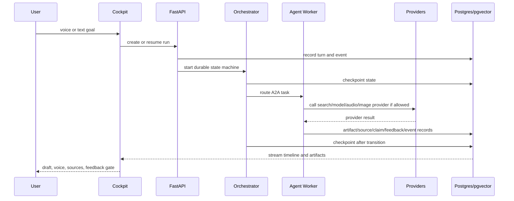

# LLD - Agent Studio System Design

## Run Lifecycle



## Core Tables

- `runs`: durable run identity and goal.
- `run_events`: append-only event stream.
- `run_checkpoints`: resumable state snapshots.
- `agent_messages`: A2A-style work packets.
- `sources`: source metadata, rights/provenance, adapter, and source-class status.
- `ingestion_runs`: auditable source intake, extraction, refresh, and failure records.
- `artifacts`: generated and extracted outputs with provenance.
- `chunks`: source-derived retrieval units with chunk policy and source context.
- `embedding_records`: vector representations with embedding model and index version.
- `retrieval_traces`: query rewrites, filters, candidates, accepted evidence, rejected evidence, scores, and latency.
- `claims`: claim support state.
- `artifact_revisions`: artifact comparison and revision history.
- `feedback_items`: human feedback gates.
- `preference_pairs`: chosen/rejected outputs with evaluator, rubric, order, and evidence references.
- `route_registry_entries`: prompt/model/graph/retriever/reranker/grader route candidates.
- `route_change_proposals`: reviewable route diffs with capacity estimate, eval gates, source snapshot, rollout, rollback, and approval decision.
- `agent_releases`: approved route bundles with eval suite, serving profile, and rollback.
- `eval_datasets`: fixed evaluation sets with leakage and coverage metadata.
- `eval_runs`: route measurements with metrics, failure slices, costs, and trace samples.
- `serving_profiles`: latency class, deployment mode, scaling, cost, and cleanup policy.
- `capacity_estimates`: adaptation and serving decision records covering failure evidence, candidate intervention, data/compute/serving requirements, promotion gates, and rollback plans.
- `guardrail_decisions`: safety/source/privacy/publishing gate outcomes.
- `memories`: semantic/episodic/procedural project memory.
- `retrieval_candidates`: retrieved chunks and graph paths.
- `retrieval_quality_ledgers`: precision/recall/coverage decisions.
- `realtime_sessions`: provider-backed voice sessions and turns.
- `run_events`: also carries sanitized LiveKit/OpenRouter/Kokoro timing events such as `voice_user_turn_committed`, OpenRouter reasoning-start/text-delta events, `assistant_audio_chunk_published`, and cancellation events. Legacy Gemma/Kokoro event names may remain in old artifacts or compatibility shims, but they are not the current live-dialogue provider direction.
- `artifacts`: carries `realtime_voice_timing_ledger` evidence packets for session readiness and voice latency review.

## Provider Interfaces

```python
class RealtimeAudioProvider:
    async def create_session(...): ...
    async def send_audio_or_text(...): ...
    async def close_session(...): ...

class ExpertModelProvider:
    async def generate(...): ...

class RerankerProvider:
    async def rerank(...): ...

class SearchProvider:
    async def search(...): ...

class ImageGenerationProvider:
    async def generate_or_edit(...): ...
```

## Latency Classes

Provider calls must declare one latency class before execution:

- `realtime_interrupt`: barge-in, short acknowledgement, and spoken turn-taking.
- `conversational_reply`: natural text/voice response that can stream.
- `quick_critique`: short review or routing decision.
- `long_synthesis`: source-backed article, script, or strategy generation.
- `background_research`: search, retrieval expansion, graph traversal, and freshness checks.
- `media_generation`: image/audio/video production or editing.

Each provider event records selected provider, model, latency class, input/output size, measured latency, fallback reason, and smoke-proof status.

## Realtime Voice Timing Evidence

The voice timing ledger is the readiness gate for the OpenRouter/LiveKit/Kokoro path.

The Python LiveKit participant maintains a short in-process voice session history for turn-taking. After each successful, failed, or canceled turn, the participant applies the configured `RealtimeContextPruner` to that maintained history, replaces pruned raw-audio refs with transcript/summary records, bounds the retained context window, and emits `voice_session_history_pruned`. The `raw_audio_turns_after` field must be computed from the final retained turn list, not from the pre-window compacted list, so runtime proof matches the actual memory carried into later turns.

Timing readiness requires media-bridge proof, not only room or participant presence. The Python LiveKit participant emits `voice_agent_media_bridge_ready` only after subscribing to a creator audio track and wiring the track into the Rust VAD/barge-in path. The timing ledger includes this as `livekit_audio_track_bridge` and only marks `ready` when the proof is scoped to the latest/current LiveKit session and occurs before speech or turn evidence. Older complete sessions, unscoped events, and late bridge events must remain `needs_more_evidence`.

The creator-facing timing UI should translate timing-stage proof into operational language. A missing media bridge should tell the creator that the backend agent has not confirmed the active microphone track bridge and should offer the next timing action. A failed provider turn must take precedence over media-bridge retry copy, because recovery should first fix OpenRouter/Kokoro provider failure before asking for another spoken proof turn.

The live state strip is a projection of the active turn, not a raw event log. A media-bridge-ready event can advance a connected room to listening, but it must not downgrade active thinking, speaking, or interruption states if the event arrives late.

Product startup proof now also has a launch-checklist layer before timing evidence. The creator voice panel derives the first blocking prerequisite across run context, LiveKit transport, runtime readiness, OpenRouter/Kokoro agent process, joined room, and participant presence. It exposes a setup check that refreshes process status, runtime preflight, and participant proof, plus a resolver action that starts/probes the next required step. Timing ledgers still remain the stronger post-session proof for latency and barge-in behavior.

Runtime readiness must distinguish hard voice blockers from optional always-on durability gaps. The direct voice-agent backend event sink is a required preflight artifact for the current provider-backed proof packet, while malformed or unreachable optional sink configuration should still fall back to the LiveKit data-channel event path rather than crashing the participant. Current required checks are `livekit-transport`, `livekit-agent-participant`, `voice-agent-backend-event-sink`, `openrouter-live-dialogue-reasoning`, `kokoro-tts`, and `rust-voice-edge`. The runtime must enforce the same URL boundary as readiness before POSTing events: HTTP(S) FastAPI backend origin only, no credentials, no path, no query string, no fragment, and valid port parsing.

The launch-checklist layer is now durable. Every setup check or resolver attempt can be written through `/api/runs/{run_id}/voice-setup-proof`, producing a `voice_setup_proof` artifact and `voice_setup_proof_recorded` event with the checklist snapshot, primary blocker, runtime/process statuses, provider, transport framework, and creator-panel provenance. This gives the run timeline an auditable trail for failed or partial voice startup attempts before any realtime timing ledger exists.

Voice-agent events must have two delivery paths. The LiveKit data channel remains the low-latency browser path for captions and immediate UI projection, but the Python LiveKit participant should also be able to persist the same event directly to FastAPI through a best-effort backend sink. Every emitted event carries a stable `voice_agent_event_uid`; the voice-events API deduplicates browser and agent submissions by that UID before writing `run_events`, materializing conversation turns, or creating follow-up tasks. Duplicate responses still return existing materialized-turn and follow-up hints so the UI can continue the live voice chain when the backend sink wins first. Backend sink failure must not break the LiveKit data-channel path or the active spoken turn.

The creator artifact board must separate generated content from operational evidence. The default view should prioritize content artifacts such as posts, reels, Substack drafts, distribution packages, and media, while a proof/evidence filter exposes ledgers, setup proofs, and other operational artifacts. Revision selection must be restricted to content artifacts; operational artifacts remain browseable, copyable, and exportable.

The board must summarize setup proof artifacts directly. `voice_setup_proof` should render as a compact operational evidence card with status, action, provider, transport, blocker, runtime readiness, LiveKit process, OpenRouter/Kokoro process, and captured-step count, while raw JSON remains available only through copy/export paths.

Failed provider-backed voice turns have their own recovery loop. A persisted `gemma_kokoro_voice_turn_failed` event creates an idempotent `review_realtime_provider_failure` task for Inference Systems Engineer. The worker records a `realtime_provider_failure_recovery` provider-operations ledger, blocks unsafe fallbacks, and creates deterministic child tasks for Observability Agent and Agent Harness Engineer. A bounded worker cycle must be able to complete all three tasks, proving a runtime health ledger and checkpointed resume plan exist before the operator retries live voice. Replay of that cycle must be idle and must not duplicate tasks, artifacts, or fake assistant turns. Product voice-event responses should carry recovery continuation hints: `followup_kind=provider_failure_recovery`, `followup_worker_agent_ids=[inference-systems-engineer, observability-agent, agent-harness-engineer]`, and `followup_worker_use_gemma=false`, so the creator UI runs the focused deterministic recovery lane instead of the full default worker roster. The provider-backed voice release gate must also compare artifact timing: a newer recovery ledger blocks readiness until a newer same-session live provider-smoke ledger passes, preventing stale green smoke from masking a later provider failure.

Required event path:

1. LiveKit agent emits `gemma_kokoro_voice_agent_ready` on data topic `agent.voice.event`.
2. Rust edge emits `voice_user_speech_started`.
3. Python LiveKit participant emits `voice_user_turn_committed` before scheduling the OpenRouter turn.
4. OpenRouter/Kokoro engine emits reasoning-start/text-delta events and `assistant_audio_chunk_published`.
5. Barge-in emits `voice_edge_cancellation_acknowledged` and the engine emits `gemma_kokoro_voice_turn_cancelled` for the same response id.
6. `POST /api/runs/{run_id}/realtime-voice-timing-ledger` builds a durable `realtime_voice_timing_ledger` artifact.

Manual interrupt contract:

- Creator-initiated barge-in must send the realtime control before waiting on durable API writes. The browser clears local playback, publishes `voice_interrupt` on LiveKit topic `agent.voice.control`, and then records the durable session-control event with the published control id or error.
- The Python LiveKit participant validates run/session targeting, resolves the provided `response_id` or current active OpenRouter/Kokoro response, calls engine cancellation, and emits `voice_manual_interrupt_received` with explicit cancel/clear/stop actions.
- If there is no active response, the participant emits `voice_interrupt_no_active_response`; the product UI resolves the request as no active output rather than pretending a model cancellation happened.
- The state strip may show agent acknowledgement as progress, but final stop proof still requires `gemma_kokoro_voice_turn_cancelled` or an explicit no-active-response acknowledgement.
- The LiveKit data-channel trust boundary is part of the contract: control messages require topic `agent.voice.control`, explicit matching run/session ids, and the creator participant identity stored in the session state. Missing target ids, wrong topics, wrong senders, and wrong sessions are ignored without emitting ready or cancellation events.
- Stopping a provider-backed voice session is also a cancellation action. The product must send the agent stop-output control, record durable `stop_output` with OpenRouter cancel / Kokoro clear / LiveKit stop actions, suppress content follow-up creation for the stop itself, then disconnect and mark the session ended.
- Stop completion is subject to the same stale-run policy as start and proof requests: late stop/disconnect/session-end completions must not clear a newer active voice session. The panel needs a stop-sequence plus run/session ownership guard before final UI state writes.
- A connected voice room needs ongoing participant liveness, not only startup proof. The product should periodically refresh durable OpenRouter/Kokoro participant presence and challenge the agent with a new presence probe only when current proof is missing, stale, or old. Liveness checks must be run/session scoped so stale monitor completions cannot repaint a newer session.
- Live microphone publishing is a first-class runtime control. The product should expose Mute/Unmute only for active provider-backed LiveKit sessions, invoke the transport runtime instead of only changing local UI state, bind late mic-control completion to the originating run, realtime session, and local operation sequence before repainting the state strip, and listen to local track publish/unpublish/mute/unmute signals so out-of-band transport changes do not leave the visible mic state stale.
- Live captions should be derived from the same durable-safe data-channel events that drive persistence. OpenRouter text deltas may be shown as assistant draft captions, committed user transcripts may be shown when available, and the UI must still treat audio-only user turns as transcript-pending until a real transcript exists. Caption reducers must correlate by turn id and response id, because multiple responses can overlap in one LiveKit session during barge-in or rapid follow-up turns.
- Pending audio turns are promotable state, not final content. If a `voice_user_turn_committed` event first arrives without transcript, the user `ConversationTurn` remains transcript-pending. When the final transcript later arrives for the same turn id, Postgres must promote the row under the voice-turn advisory lock, avoid duplicate promotion events on replay, and patch existing Realtime Conversation Host follow-up payloads with `final_user_transcript` and the source excerpt through payload-only message updates. The frontend must remember recent turn ids so stale previous-turn speech-start or commit events cannot repaint a newer active turn, while unknown new turn ids still start valid barge-in or follow-up turns.

OpenRouter live-dialogue contract:

- OpenRouter live dialogue should use `deepseek/deepseek-v4-flash` through the configured OpenRouter credential path and emit `openrouter-live-dialogue-reasoning` readiness.
- `OPENROUTER_LIVEKIT_URL=ws://127.0.0.1:7880` is configured for local LiveKit development transport.
- Hugging Face/Gemma/Gamma/MLX routes may remain as historical source-background or explicit non-default experiments, but missing HF/Gemma/Gamma/MLX configuration must not block the current OpenRouter/LiveKit/Kokoro path.
- Streaming is a readiness dimension, not just a UX detail: provider smoke should measure time-to-first-text and time-to-first-audio before the voice path is considered production-ready.

Regression guard:

- Do not mark readiness from unrelated first events across different turns, sessions, or response ids.
- Do not call the end-of-turn stage measured unless `voice_user_turn_committed` exists.
- Do not call barge-in measured unless cancellation acknowledgement and turn-cancelled events correlate to the same response.

## Rust Voice Edge Sidecar

The Rust voice-edge service has three local modes:

- stdin/stdout one-shot JSON for debugging;
- persistent `--jsonl` for the current Python LiveKit participant frame loop;
- stateless Axum/Tokio HTTP sidecar through `--http ADDR` or `serve [ADDR]`.

Python selection:

- `RUST_VOICE_EDGE_HTTP_URL` configured: use `RustVoiceEdgeHttpClient` and post the tagged contract to the supervised sidecar.
- HTTP URL plus available binary: wrap HTTP in `FallbackVoiceEdgeClient` so sidecar request failures fall back to JSONL for VAD/barge-in continuity.
- No HTTP URL: use `PersistentRustVoiceEdgeClient` when `RUST_VOICE_EDGE_BINARY_PATH` exists.
- Neither available: fall back to max-audio-window capture without Rust VAD/barge-in proof.

HTTP contract:

- `GET /healthz`: service, transport, VAD, and state-model metadata.
- `POST /v1/voice-edge`: tagged `VoiceEdgeRequest` with `kind = analyze` or `kind = cancel`.
- `POST /v1/voice-edge/analyze`: typed analyze request without the outer tag.
- `POST /v1/voice-edge/cancel`: typed cancel request without the outer tag.

Implementation guard:

- The HTTP sidecar must be described as request/response transport, but the long-running Rust process may preserve bounded per-stream Silero recurrent state while alive.
- CLI modes must be explicit and mixed or unknown args must fail fast rather than falling into stdin.
- Cancellation acknowledgement must keep all four side effects explicit: drop outbound audio, cancel OpenRouter reasoning, clear Kokoro buffers, and stop LiveKit audio.
- Next Rust upgrades are benchmarked concurrent-session tuning and the LiveKit-side Rust media bridge.

## Capacity Estimates

Before a route is fine-tuned, distilled, quantized, self-hosted, or promoted into a dedicated serving lane, the proposal should produce a capacity estimate. The estimate records the measured failure, the lighter interventions already attempted, data requirements, compute and serving requirements, eval gates, cost/latency risk, and rollback route. See [[Capacity Estimation - Adaptation and Serving Decisions]].

## Route Change Proposals

Production or canon-impacting route changes should be captured as route change proposals before release. The proposal records the exact route diff, linked capacity estimate when needed, eval gates, source/retrieval snapshot, rollout stage, rollback trigger, and owner decision. See [[Route Change Proposal Template]].

## Feedback Gates

Feedback gates block autonomous progress when:

- source support is missing,
- retrieval precision/recall policy is risky,
- memory policy is stale or conflicting,
- provider smoke evidence is missing,
- output is publishable but guardrails are not complete,
- user explicitly asks for revision.

## Product Autopilot Runtime Proof

The creator-facing app must prove Autopilot through the product surface, not only through CLI or planning tools. A valid local proof is:

1. Start FastAPI against Postgres.
2. Start the Next product app with `NEXT_API_PROXY_TARGET` pointing at that FastAPI origin so browser requests stay same-origin through `/api/*`.
3. Create or restore a durable run from the creator app.
4. Start Autopilot from the Activity panel.
5. Confirm scheduler and heartbeat evidence appears in the same Activity panel from live run events or refreshed run context.
6. Stop Autopilot and verify the profile status and `worker_profile_stopped` event are persisted.

Latest proof: run `191f525c-4861-4144-afe5-b0a780c4b26f` created a content workflow, streamed live events, started Autopilot, recorded idle scheduler proof and blocked heartbeat proof while the run waited for human feedback, then stopped the worker profile with event `#69730`. Screenshot evidence is `screenshots/autopilot-live-postgres-proof.png`.

## Worker Routing

The default worker cycle includes all 38 roster agents. The four engineering specialists now have concrete deterministic worker paths:

- Backend Platform Engineer: architecture review focused on API, Postgres, pgvector, migrations, and consistency.
- Frontend Experience Engineer: UX/frontend review focused on cockpit controls, state, and accessibility.
- Scalability/Reliability Engineer: architecture review focused on SLOs, capacity, backpressure, scheduling, and degradation.
- Inference Systems Engineer: architecture review focused on OpenRouter live dialogue, legacy Gemma/HF routes where explicitly selected, realtime providers, latency, cost, fallback, and smoke proof.

## Source-Backed Content Flow

1. Intent Router classifies the user request.
2. Web Research Agent searches current sources when freshness or external data is needed.
3. Retrieval Intelligence Agent expands queries, applies metadata filters, retrieves lexical/vector/graph candidates, fuses candidates, reranks, and evaluates coverage.
4. Knowledge Graph Curator normalizes entities, claims, topics, artifacts, memories, and graph paths.
5. Source Ledger Agent records accepted and rejected evidence with reasons.
6. Claim Verification Agent maps claims to accepted evidence or marks them unsupported.
7. Writers generate ELI5 short-form or detailed Substack drafts from accepted evidence and context packs.
8. Editor, Guardrails, Influencer Strategy, and Platform Optimization agents review.
9. Human feedback gates route typed changes back to owner agents.

Initial run creation follows the same evidence boundary as later worker refresh. If provider-backed web search fails, the workflow records redacted `provider_fallback` and `web_research_blocked` proof, keeps search-query seed sources as pending placeholders, and leaves seed-linked claims `needs_review` so the first draft cannot pass as source-supported until real provider or accepted retrieval evidence exists.

## Memory Promotion Flow

1. Interactive Note-Taking Agent records interaction notes and feedback.
2. Feedback Routing classifies each item as factual correction, style preference, audience strategy, workflow issue, source issue, model issue, or UI issue.
3. Product Manager or Forward Deployed Engineer reviews memory impact.
4. Approved lessons become typed project memory or Obsidian wiki updates.
5. Future context packets retrieve only relevant memories and expose precision/recall risk before agents rely on them.

Standalone interactive HTML notes may embed durable run state for review, but the embedded JSON and visible title must pass the same normalized metadata and token-string redaction boundary used by realtime/provider surfaces before the file is written or the `html_note` artifact is persisted.

## Mixed-Mode Live Dialogue Contract

- Live voice is a session boundary, not an input-mode restriction: microphone audio and typed text can both target the same OpenRouter/Kokoro LiveKit participant.
- The frontend sends typed live turns over LiveKit data, not the REST rehearsal turn endpoint, so the agent hears them in the same realtime room and responds through the same assistant event and Kokoro audio path.
- Required payload fields: `type=transcript_turn`, UUID `turn_id`, `run_id`, `realtime_session_id`, `room_name`, `expected_agent_identity`, trimmed `transcript`, and optional Kokoro `voice`.
- Trust boundary: the Python participant must require `agent.voice.control`, matching run id, matching realtime session id, and the expected creator participant identity before scheduling the OpenRouter/Kokoro engine.
- Rejection boundary: empty or non-string direct transcript turns emit `voice_text_turn_rejected` and are not forwarded to OpenRouter.
- Provenance boundary: user commit events include `input_modality=text` for typed turns and `input_modality=voice` for captured audio turns; API materialization preserves this as conversation-turn modality.
- UX boundary: the typed live-turn form is product UI, not planning UI. It is disabled until the LiveKit room is joined and fresh agent presence proof exists; if the agent is thinking or speaking, text input sends the interrupt contract before the new turn.

## Product Source Ledger Visibility

- The creator app must show source provenance close to draft review so source-backed claims are inspectable without opening raw JSON ledgers.
- Source rows expose source type, freshness, search rank, search query, published timestamp, retrieved timestamp, and snippet when recorded.
- Search-query seed sources are warnings, not evidence. The UI must say they still need provider-backed web research before publish.
- Search-query seed sources are also a product action boundary. The Source panel shows live-source and search-seed counts and exposes `Run web research` only while unresolved search seeds exist.
- The refresh action creates a targeted A2A `research_topic` task for `web-research-agent` when no runnable task already exists, then runs a bounded worker cycle for Web Research Agent and Claim Verification Agent with Gemma disabled.
- The action passes visible deduped seed queries as capped `search_queries`; Web Research Agent must execute each admitted query, record per-result `search_query` metadata, and report skipped query count when the cap is reached instead of searching only the first display topic or fanning out without bound.
- Once source repair moves claims away from weak/search-seed sources, historical seed records remain in the ledger for provenance but should not keep the refresh affordance visible as unresolved work.
- Runnable web-research tasks require task type `research_topic` and status `accepted`, `claimed`, or `in_progress`; unrelated task types, failed, blocked, canceled, completed, or human-waiting tasks must not block a fresh source-refresh enqueue.
- Missing provider-backed search configuration is explicit product evidence. With Gemma fallback disabled, Web Research Agent records `web_search_provider_blocked`, emits `web_research_blocked`, and builds a research freshness ledger instead of returning a generic deterministic completion.
- Source panel status uses durable web-research task/event proof to show blocked provider reason or refreshed accepted-source count directly beside the source ledger.
- Successful source refresh must continue the multi-agent loop. If source repair updates claim dependencies, Web Research Agent creates an idempotent `verify_source_refresh_claims` handoff for Claim Verification Agent unless another runnable claim-verification task already exists.
- Source refresh is a same-run mutation boundary, not a passive read. The product `Run web research` action must own a synchronous source-refresh action gate, contribute that gate to the shared run-mutation snapshot, and reject overlapping composer, retry, feedback, production, always-on, local scheduler, work-plan, and worker-cycle mutations before any mutating API call starts. New/run replacement invalidates the source-refresh owner. Source sync: `social_media_optimiser/wiki/ops/active-codex-context.md` source-refresh gate update, 2026-05-19.
- Provider-backed source refresh must rank the source set before durable repair, not just after a later retrieval-quality pass. Web Research Agent dedupes provider URLs, turns provider results into rerank candidates with source quality and freshness metadata, orders recorded `worker_web_search_result` records by configured reranker output or deterministic fallback, and stores original `search_rank` separately from `rerank_rank`, `rerank_score`, `reranker`, and `rerank_reason`. Reranker failures degrade to deterministic reranking with redacted fallback proof; search-provider failures still block when Gemma fallback is disabled.
- Provider-backed source refresh must also build retrieval-quality proof before the claim-verification handoff runs. The sequence is: provider search, URL dedupe, source-level rerank, source record persistence, source repair, freshness ledger, retrieval-quality ledger, then `verify_source_refresh_claims`. Claim Verification treats retrieval ledger presence as the enforcement switch; a ledger with zero accepted sources is still a hard evidence gate and raw source ids cannot bypass it. Only reranker-call failures may use deterministic fallback; retrieval ledger persistence/state failures must surface as worker errors.
- The creator-facing source-refresh action should allow that claim-verification follow-up to execute in the same bounded refresh cycle when Web Research Agent creates it, making the UI evidence closer to the actual source and claim state.
- The handoff payload carries repaired claim ids, replacement source ids, freshness ledger id, and source-repair metadata and depends on the parent web-research message.
- Malformed source URLs render as non-link titles so source inspection is safe even when provider metadata is imperfect.
- Claim support summary is a first-class UI signal: supported, needs-review, and unsupported counts appear above the source list.
- The source ledger UI should preserve provenance nuance rather than collapsing all records into generic links.
- Accepted retrieval evidence now appears in the product Source panel from context `source_evidence`: accepted/not-accepted context status, retrieval rank, rerank score, reranker, quality/freshness, coverage topics, rerank reason, and precision/recall risks are visible per source.
- Source-level rerank proof appears before accepted-context evidence exists: provider search results can show rerank rank, score, reranker, and rerank reason directly from source metadata. This is ordering/provenance proof only; publish readiness still depends on accepted retrieval evidence, claim support, reviewer decisions, and feedback gates.
- Accepted-context evidence appears in the same source-refresh action once retrieval quality is built. The product may then refresh context and show `source_evidence` without requiring a separate manual retrieval-quality pass; blocked/zero-accepted ledgers should make claims and publish readiness stricter, not silently fall back to raw source ids.
- The product source ledger distinguishes evidence coverage from raw source volume by separately showing live source count, unresolved search seeds, accepted context evidence, precision risks, recall risks, coverage topics, and quality issues.

## Product Draft Evidence Visibility

- Draft cards are the creator's review boundary, so they must surface source and guardrail state before copy/export/revision actions.
- Each card shows source count, supported/review/unsupported claim counts, latest reviewer decision, revision count, and deduplicated linked-claim count.
- Risk tone is deterministic: no sources or unsupported claims block the draft, needs-review claims require review, and fully supported drafts are marked supported.
- Draft claim linkage prefers explicit artifact `claim_ids` from content/provenance; source-overlap is only a legacy fallback.
- Linked claims are deduplicated across source ids because one claim can cite multiple sources on the same artifact.
- This keeps evidence visibility inside the actual product app while preserving the separate Obsidian/system-design planning workspace.

## Product Artifact Content/Proof Boundary

- The artifact board is a creator surface first: default view is generated content, not operational ledgers.
- Proofs and ledgers remain inspectable through `Proofs` and `All`, but they are evidence artifacts with Copy/Export only.
- Content artifacts are `post`, `reel_script`, `substack_article`, `social_package`, `visual_brief`, `image`, `audio`, and `video`.
- Non-content artifacts must not show revision selection controls or linked-claim revision pills, and stale non-content selected ids must not enable the revision form.
- Revision, media-plan, distribution-package, and publish-readiness calls use the content-filtered selected artifact list.
- Component tests and static page contract tests lock this boundary; `Leibniz` review found no blockers.

## Product Production Content Readiness

- The production controls must show a creator-facing readiness preflight before package/media/publish actions.
- Readiness is not raw artifact existence. It depends on publishable artifacts, accepted context evidence, artifact claim traces, supported claims, reviewer decisions, and resolved/routed feedback gates.
- Source-backed status must use accepted source evidence, not any `source_ids` value. Accepted evidence may match by `source_id`, `citation_id`, or an accepted source record's `artifact_ids`.
- `no_content` disables all production actions because there is nothing to package or check.
- `blocked` disables platform and media packaging because unaccepted sources or unsupported claims should not be turned into distribution artifacts. Publish check remains available so the backend can produce a durable blocker report.
- Publish-channel readiness is an opt-in non-live smoke. It checks credential presence and explicit policy acknowledgement for normalized publish platforms across social packages plus direct selected publishable artifacts with platform metadata, including posts and reel scripts. It must not post externally and must not echo credential values in readiness results, run events, product UI, or cockpit/operator projections. This smoke does not prove destination account permissions or live API publishability.
- The preflight is part of the product app, not the planning workspace or board-style planning surface.

## Product Voice Provider Release Gate

- The product voice panel, not the planning workspace, owns creator-facing provider readiness.
- The panel reads `/api/provider-readiness` and projects a selected-route release gate over selected OpenRouter live-dialogue readiness, selected LiveKit transport, selected Kokoro realtime output, selected web-search readiness, selected reranker readiness, runtime preflight, current OpenRouter/Kokoro participant presence, and latest provider-smoke proof.
- Missing configuration is scoped to selected providers only. Inactive OpenAI, Cartesia, ElevenLabs, Hugging Face/Gemma/Gamma/MLX, or alternate provider records can stay in the registry, but they must not appear as blockers for the OpenRouter/LiveKit/Kokoro path.
- Transcript rehearsal and non-live smoke are product proofs, not production readiness.
- Current-session readiness requires an active provider-backed LiveKit session, with participant proof and provider-smoke evidence bound to that same `realtime_session_id`.
- A route becomes preflight-ready when `provider-backed-live-voice-proof.preflight-validation.json` is `valid_preflight_artifacts` for `livekit-transport`, `livekit-agent-participant`, `voice-agent-backend-event-sink`, `openrouter-live-dialogue-reasoning`, `kokoro-tts`, and `rust-voice-edge`. UUID `190ae2f9-a74b-4a23-b39c-aaf2d636bd8e` is in `provider_backed_live_voice_preflight_ready_record_capture_needed`.
- OpenRouter streaming/readiness evidence requires `deepseek/deepseek-v4-flash` through OpenRouter and the configured local LiveKit URL `ws://127.0.0.1:7880`; `GEMMA4_MULTIMODAL_ENDPOINT_URL`, HF router chat-completions, Gamma, and MLX are not current blockers.
- The product voice panel should dispatch runtime readiness with named option objects. Full Runtime preflight uses one explicit option set for edge, agent, LiveKit, OpenRouter live dialogue, and Kokoro; LiveKit transport refresh uses a transport-only option; passive refreshes use no option object. These option contracts belong in the shared runtime-readiness helper, where tests can assert actual exported values instead of depending on component-source formatting. This keeps future provider probes from being accidentally omitted by boolean-position drift.
- The launch checklist is downstream of the release gate, not parallel truth. Once transport, runtime, room, and participant prerequisites are satisfied, selected-provider blockers, unresolved provider-failure recovery, and missing live provider-smoke proof must still block setup readiness.
- Provider-readiness blockers are refreshable operational blockers, not fake readiness. `Resolve next` can refresh `/api/provider-readiness`, but current live voice should only block on selected OpenRouter, LiveKit, Kokoro, Rust edge, backend event sink, web-search, or reranker configuration.
- The `Resolve next` control for provider-recovery or live-smoke blockers must invoke the explicit live Runtime smoke path, including creator confirmation before external OpenRouter/Kokoro endpoints are called.
- Live-smoke resolver proof must be post-action proof. After smoke completes, the setup proof uses the new provider-smoke result to rebuild the release gate and checklist. Because provider-recovery clearing depends on smoke evidence being newer than the recovery ledger, the just-built smoke result is represented as provider-smoke-ledger-shaped evidence until refreshed run artifacts arrive.
- Product UI must distinguish provider-route readiness from accepted voice-to-voice proof. Current live voice has no remaining operator-input blockers, but completion remains blocked until accepted proof-record capture/recheck records the OpenRouter/LiveKit/Kokoro path and external publication proof is accepted.
- Synthetic smoke is useful provider-boundary evidence, but it is not voice-to-voice proof. If the smoke used synthetic audio, the next action is to speak in the active LiveKit room, wait for the captured audio artifact to persist, and rerun live Runtime smoke.
- The live voice proof path owns an executable primary action for the first open proof step: selected-provider blockers refresh provider readiness; runtime blockers run runtime preflight; missing active session joins the LiveKit room; missing participant proof probes presence; missing captured-audio, streaming, or live-smoke proof runs live Runtime smoke; missing timing proof builds the realtime Timing ledger. Async participant-probe callbacks must be guarded by run/session identity plus a per-action continuation token.
- Session-bound live smoke must also prove captured-audio freshness. The provider-smoke request carries a bounded max audio artifact age, defaulting to 120 seconds. If the only matching same-session microphone artifacts are stale, the OpenRouter/Kokoro smoke step returns `session_audio_artifact_stale` with stale-age evidence and does not call OpenRouter or Kokoro. This keeps old room audio from satisfying current voice-to-voice proof.

## Local Secret Boundary

- Provider secrets are runtime configuration, not product artifacts or planning notes.
- `OPENROUTER_API_KEY_FILE`, `LIVEKIT_API_KEY_FILE`, `LIVEKIT_API_SECRET_FILE`, and `TAVILY_API_KEY_FILE` allow local provider credentials to live in ignored files; the runtime loads those values into the effective settings object without exposing them in readiness payloads.
- Direct secret values are stripped and only non-empty direct values override file values; missing or empty secret files are non-fatal and keep the provider blocked.
- Release gates should show missing/configured credential state, never the credential value.
- Secret-file diagnostics are allowed product evidence when they expose only file env name, status, configured boolean, optional local path, and non-secret detail.
- Local development defaults may configure LiveKit dev transport through `OPENROUTER_LIVEKIT_URL=ws://127.0.0.1:7880`; OpenRouter key, LiveKit key/secret files, selected Kokoro route, and web-search keys remain explicit provider-backed inputs until supplied. Gemma endpoint URLs, HF token files, Gamma, and MLX are not current live-dialogue blockers.

## Legacy Hugging Face/Gemma Routing

- Hugging Face/Gemma expert-agent text/chat work is a legacy or explicitly selected non-default route.
- Dedicated endpoint URLs still take precedence for that legacy route because they provide clearer capacity, isolation, and model-serving control.
- The router fallback remains acceptable for historical expert-agent text drafting, review, synthesis, and provider smoke when a route explicitly selects HF/Gemma and authenticates with an HF token and model id.
- Router fallback readiness requires a valid `http(s)` router URL with a host; malformed values must remain blocked for that legacy route and must not be deferred to runtime HTTP failure.
- Native Gemma realtime audio is no longer the active live-dialogue direction. Missing Gemma multimodal endpoints, HF tokens, Gamma, or MLX must not block the current OpenRouter/LiveKit/Kokoro live voice path.

## Live Regression Gates

- The default Python regression may skip live Postgres/pgvector tests unless `LIVE_POSTGRES=1` is set. That skip is an infrastructure gate, not a product-quality pass.
- Before claiming the local durable-state slice is healthy, run the live suite against the Docker pgvector service: `env LIVE_POSTGRES=1 python3 -m pytest tests/test_live_postgres.py -q -rs`.
- For full no-skip backend confidence, run `env LIVE_POSTGRES=1 python3 -m pytest -q -rs` from a host context that can reach `127.0.0.1:5432` and bind a local Rust voice-edge loopback sidecar. Current evidence: `386 passed` when local Postgres and `services/voice-edge/target/debug/voice-edge` are available.
- Live integration assertions must preserve product guardrails: missing provider-backed search blocks web research, deterministic fallback written content remains non-publishable, model-routing ledgers flag deterministic publishable artifacts, and targeted conversational feedback should revise only inferred or explicit artifact targets.
- Async sidecar clients should be exercised and closed within the same event loop in tests, matching the long-running production loop rather than reusing a persistent client across unrelated `asyncio.run` loops.

## Activity Task Attention and Retry

- Product Activity must distinguish active work, completed outcomes, and tasks needing operator attention. Failed, blocked, and canceled A2A messages belong in a compact attention strip, not hidden inside the active-task list or event timeline.
- Attention strips are latest-first projections over durable message state. Since backend message listing can be created-time ascending, the frontend projection must sort by updated time before applying a compact cap.
- Retry may say `Queue and run` only when the execution target is the exact retried message id, not merely the recipient agent inbox. A retry worker cycle must pass `message_ids=[retried_message_id]`, validate target message run/recipient/status before claim, and process one bounded task for that target.
- Targeted retry execution must not run broad stale recovery or retry-exhaustion mutation for unrelated accepted inbox work. If target message ids resolve to no runnable agents, the worker cycle must stay idle rather than waking the default roster.
- Retry requests must be guarded synchronously on the client before the POST, because React's disabled state is not a reliable double-click barrier. A per-message in-flight guard prevents the second request from seeing the already-requeued backend state and surfacing a false error.
- Runtime error text is untrusted product input. Attention summaries should prefer structured result reason fields, redact bearer/HF/Tavily-shaped strings before display, and only then fall back to generic operator-attention copy.

## Always-On Activity Observability

- The product app must make always-on profile state readable without turning the creator UI into a planning board. Activity can show Start, Run due, Heartbeat, Stop, scheduler proof, heartbeat proof, and compact schedule state, but board-style planning surfaces stay outside the product app.
- Schedule state is derived from durable worker-profile fields: `status`, `last_heartbeat_at`, `poll_interval_seconds`, `heartbeat_claimed_by`, and `heartbeat_lease_until`.
- The visible states are `Due now`, `Scheduled`, `Heartbeat running`, and `Not running`. Due and scheduled states expose next-due timing; running states expose lease-until timing and the claimant when present.
- The frontend should refresh schedule display locally while the page remains open so a scheduled profile naturally becomes due even if no new run event has arrived yet. Durable truth still comes from the next scheduler/heartbeat event and refreshed run context.
- Browser-session auto wake is allowed for local-first usability but must reuse the same durable scheduler path as manual `Run due`. It must be run-scoped, active-profile scoped, blocked while the page is busy, blocked while the scheduler is already in flight, and deduped by due-window wake key so a blocked pass does not loop. This is not a replacement for a server/cron scheduler when the app is closed.
- Runs may contain multiple `autonomous_pass` profiles after retries, replacement launches, or stale operator actions. Product UI must choose the newest active Autopilot profile deterministically before displaying schedule, heartbeat, or scheduler proof, and proof matching must be profile-id scoped so an older profile's ledger cannot make the newer profile look healthy. Run-scoped idle scheduler events that carry no profile ids are only proof for the selected profile when the event was created after that profile. Scheduler wakeup is slightly different: it should wake the newest due active profile, but if the newest active profile is scheduled and an older active profile is already due, the wake decision should still run that older due profile through the durable run-scoped scheduler.
- Local background execution uses the same scheduler contract through `all-about-llms-admin run-worker-scheduler --watch`. Operators can scope the loop with `--run-id` and `--execution-mode autonomous_pass`, or cap a validation run with `--max-iterations`. The CLI must build the same `WorkerSchedulerRunRequest` as the API so browser-open auto wake, manual `Run due`, and detached local scheduler loops share durable leases, events, and heartbeat ledgers.
- A scoped scheduler no-work pass is durable state, not absence of evidence. If `run_id` is supplied and zero profiles are due, the scheduler writes `worker_scheduler_pass_completed` with `idle_reason=no_due_profiles`, requested run/mode, zero checked/heartbeat/task counters, empty profile/artifact arrays, and zero retrieval/memory-risk counters. Global no-work passes do not write events, preserving signal in long-running loops.
- The product app exposes local background-runner process control through FastAPI, not direct browser process management. `LocalWorkerSchedulerSupervisor` owns status/start/stop for `run-worker-scheduler --watch --run-id <run-id> --execution-mode autonomous_pass`, injects the project `PYTHONPATH`, tracks pid/returncode/run/cadence/profile cap, redacts provider and database secrets from log tails and errors, and avoids duplicate processes unless the API caller explicitly uses `force_restart`. The creator Activity rail shows `Background runner` status and Start/Stop controls, but Start must be gated on the newest active run-scoped always-on profile, preserve the worker-profile cadence floor, and use a control-generation token so background status polling cannot overwrite a fresher Start/Stop result. Stop must preserve stale run/version ownership before updating UI state. Internal supervisor/API names may still use scheduler/autopilot terminology, but creator-visible copy must use `Always-on studio`, `Specialist pulse`, and `Background runner` language.
- The product app should subscribe to durable run events directly. Browser code consumes `/api/runs/{run_id}/events/stream` with a fetch-based SSE parser because backend event names are semantic and custom; streamed events merge into the same `recent_events` state used by Activity/Source proof panels. Stream mutations must be guarded by active run id and run-version ownership to prevent late old-run streams from repainting a new session.
- Event streams are evidence-first and refresh-triggering. High-level mutation events schedule a debounced silent context refresh so full run state catches up without manual user action; high-frequency voice token/audio events stay stream-only and must not fetch the entire run context on every chunk. Silent refresh preserves user busy/error state and updates context, worker profiles, event cursor, and status summary only when the run/version guard still matches. Do not rely only on event-name suffixes; durable task events with irregular names must be explicitly included in the refresh classifier.
- Stale async cleanup must be version-scoped, not just run-id-scoped. No-run states all share `runId=undefined`, so completion handlers that run after `New` or run replacement must clear busy state only when their captured run id and run version still match the active `RunVersionSnapshot`. For same-version no-run actions, `Plan next`, feedback actions, production actions, always-on launch/stop controls, and local background-runner process controls, React disabled/busy state is not enough; handlers need a synchronous in-flight token so duplicate submits cannot both commit. Related work-plan actions must also exclude each other synchronously: `Plan next` blocks while the agent-cycle lock is active, and `Run plan` blocks while the work-plan planning gate is active, preventing stale same-run work-plan overwrites after rapid cross-clicks. Run-mutation entry points that can change the same run, including manual continuation, live voice follow-up continuation, source refresh, Activity retry, composer submit, feedback actions, production actions, Autopilot profile controls, and local scheduler controls, must reject while `Plan next` owns the work-plan gate; `Plan next` must reject while those mutation gates or scheduler/heartbeat refs are active. The run-mutation decision belongs in a shared state helper with behavior tests, with page source contracts only verifying handler ordering before mutating APIs.

## Provider Failure Boundary

- Provider adapters must normalize external failures before they reach orchestration. HTTP status failures, network/request errors, invalid JSON, non-object JSON, malformed result fields, and all-invalid provider result records from web-search providers become provider configuration/runtime blockers that Web Research Agent can persist as `web_search_provider_blocked` evidence.
- Mixed provider result lists are accepted only for valid source records; malformed records are discarded before storage so the source ledger never stores non-URLs or non-object result items as evidence.
- Raw `httpx` exceptions or provider-payload shape errors should not leak into the creator app as 500s during source-backed drafting or source refresh. The product UI needs durable blocked/search-ready evidence, not transport-stack errors.
- Provider tests use injected transports and local base URLs so failure modes are covered without live network calls or real credentials.
- Heavy runtime modules should not be imported from package `__init__` files when that creates provider factory cycles. LiveKit server entrypoints are lazy exports; lightweight models, edge clients, and engine types remain direct imports.
- Hugging Face Gemma expert calls follow the same boundary. Chat/text expert endpoints may return OpenAI-compatible choices, `generated_text`, or `text`; any HTTP status failure, request failure, invalid JSON, non-object JSON, or object with no usable content becomes `ProviderConfigurationError` before Content Workflow, Revision Workflow, Agent Worker, Provider Smoke, or the Gemma/Kokoro audio reasoner fallback can consume it.
- No provider adapter should turn a malformed successful response into draft text by stringifying raw JSON. Malformed Gemma payloads are blockers, not content.
- The realtime voice adapter applies the same rule to the Gemma/Kokoro half-cascade. Streaming Gemma HTTP failures, request failures, streams with no usable text, and whitespace-only streams are blockers. Hosted Kokoro failures, invalid JSON, invalid base64, and empty audio bodies are blockers. The LiveKit voice loop should stop with explicit provider evidence rather than silently producing empty assistant turns or invalid audio chunks.
- Provider-boundary tests for voice adapters use injected HTTP transports so Gemma/Kokoro failure contracts remain covered without live HF credentials or hosted TTS endpoints.
- The voice engine must convert provider blockers into durable run evidence. Normalized Gemma/Kokoro provider failures emit `gemma_kokoro_voice_turn_failed` with stage, assistant-text character count, audio chunk count, and output-clear/stop actions; the active LiveKit task returns a failed result instead of crashing; and the participant records the user turn without creating an assistant response that was never spoken.
- Failed voice turns are product evidence, not only logs. Timing ledgers treat `gemma_kokoro_voice_turn_failed` as a failed voice-loop status, timing turn proof carries failure stage/reason/timing, and the creator-facing voice panel moves the live state to `Failed` with the provider failure reason in captions. The voice-events API must not materialize an assistant turn or host follow-up for failed provider turns because no assistant response was completed.
- Failed voice turns must also enter the autonomous recovery loop. The voice-events API creates an idempotent `review_realtime_provider_failure` task for Inference Systems Engineer using response-id-scoped duplicate suppression, recursively redacted failure metadata, provider/session/transport context, and required recovery action. This keeps provider operations, smoke proof, model routing, latency/cost, and fallback policy owned by the specialist agent.
- The Inference Systems Engineer worker must make that recovery task concrete. It records a provider-operations recovery ledger, classifies the failed component, blocks unsafe fallback routes, requires runtime preflight/session-bound provider smoke/realtime timing proof, and creates deterministic A2A follow-ups for Observability Agent runtime health plus Agent Harness checkpoint/resume planning. Worker context builders must redact secret-shaped strings before using raw task payloads as fallback project-memory queries.
- The creator app must render recovery ledgers as operational proof, not raw JSON. The artifact board Proofs view shows the failed component, provider, transport, redacted failure reason, recovery check/action counts, owner agents, and blocked fallback, while keeping recovery ledgers out of draft revision selection.
- Live voice follow-up continuation must be lineaged, not broad. The product sends `message_ids=[followup_task_message_id]` and `continue_message_lineage=true`; the worker starts with the exact follow-up task and dynamically adds only accepted child messages whose `parent_message_id` is a processed lineage message. This allows Realtime Host, Intent Router, Content Strategist, downstream content specialists, and provider-recovery specialists to run in one bounded cycle without processing older unrelated inbox tasks.
- External worker-cycle requests must bound target message ids before storage lookups. `AgentWorkerCycleRequest.message_ids` is capped at `100`; internal `AgentWorkerRunRequest.message_ids` remains uncapped so valid lineage expansion inside a trusted worker cycle is not accidentally cut off by the API request limit.
