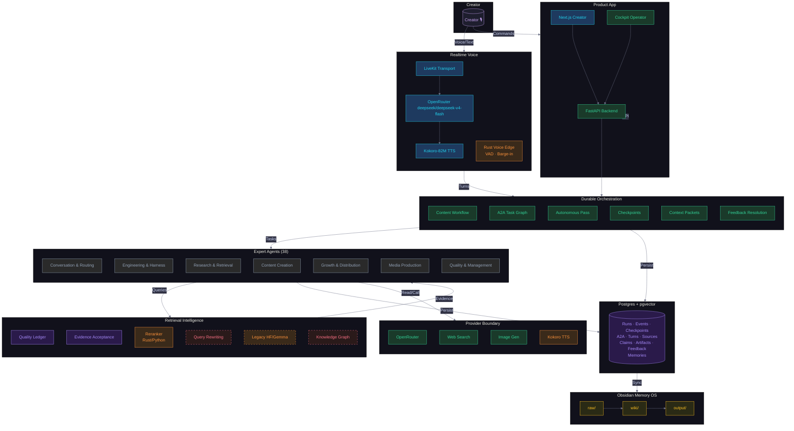

# Agent Studio Project Knowledge Graph

## WHAT IS THIS PROJECT?

**Agent Studio** is a local-first, realtime, long-running multi-agent content studio. It lives in the `all-about-llms` repo at `/Users/saumyamehta/Gen AI/all-about-llms/`.

The goal: a creator talks (voice) or types a request, and a team of ~38 AI specialists researches, drafts, verifies, packages, and publishes social media content (posts, reels, Substack articles) — all with human feedback loops, source-backed evidence, and publish-readiness gates.

The system is LOCAL-FIRST (Postgres + open models) but provider-pluggable (OpenRouter, LiveKit, web search, TTS). It is not production-deployed; it runs on the user's Mac. Current realtime dialogue defaults to OpenRouter DeepSeek V4 Flash with LiveKit and Kokoro; Hugging Face and Gamma/Gemma are not active defaults.

---

## PART 1 — SYSTEM ARCHITECTURE

### Layer 0: Realtime Voice / Conversation
Front door for the creator. Two modes:

| Mode | Transport | Reasoning | TTS | Status |
|------|-----------|-----------|-----|--------|
| Live dialogue | LiveKit data-channel | OpenRouter `deepseek/deepseek-v4-flash` | Kokoro-82M | Accepted provider-backed live voice proof |
| Chat (text only) | HTTP API | OpenRouter text | — | Proven |

Key files:
- `src/all_about_llms/voice_agent/engine.py` — LiveKit/Kokoro voice agent engine
- `src/all_about_llms/voice_agent/livekit_app.py` — LiveKit participant scaffold
- `src/all_about_llms/voice_agent/adapters.py` — OpenRouter/Kokoro adapter boundary
- `src/all_about_llms/voice_agent/context.py` — Raw-audio context pruning
- `src/all_about_llms/voice_agent/edge.py` — Rust VAD bridge
- `src/all_about_llms/providers/realtime.py` — Realtime provider descriptors
- `frontend/next-app/components/voice/RealtimeVoicePanel.tsx` — Product UI
- `services/voice-edge/` — Rust VAD/barge-in edge (JSONL + HTTP sidecar)

### Layer 1: Conversation Router & Intent Classifier
Routes user input into create, revise, research, route, clarify, or feedback actions.

- `src/all_about_llms/orchestration/conversation_router.py`
- `src/all_about_llms/orchestration/realtime_dialogue.py`

### Layer 2: Retrieval Intelligence
Multi-stage retrieval: query rewrite → hybrid search (dense+lexical+web+graph) → rank fusion → rerank → evidence acceptance → FP/FN check.

| Component | Code Status | LLD Reference |
|-----------|-------------|---------------|
| Query rewriting | Planned | `LLD.md` § Retrieval Intelligence |
| Hybrid candidate fanout | Planned | Same |
| Rank fusion (RRF) | Planned | Same |
| Reranking | Rust ranker built; Python fallback | `services/retrieval-ranker/` |
| Evidence acceptance | Implemented | `retrieval_evidence.py` |
| Retrieval quality ledger | Implemented | `retrieval_quality.py` |
| Knowledge graph curation | Planned | `LLD.md` plan for `knowledge_graph.py` |
| Retrieval evaluation | Planned | Same |

Key files:
- `src/all_about_llms/orchestration/retrieval_quality.py` — POST /api/runs/{id}/retrieval-quality-ledger
- `src/all_about_llms/orchestration/retrieval_evidence.py` — Accepted evidence extraction
- `services/retrieval-ranker/` — Rust deterministic ranker (stdin/stdout JSON)
- `src/all_about_llms/providers/rerank.py` — Python provider interface

### Layer 3: Orchestration (Durable State Machines)
LangGraph-style checkpointed workflow for content generation, A2A task execution, autonomous passes, and feedback resolution.

Key files:
- `src/all_about_llms/orchestration/content_workflow.py` — Content generation workflow
- `src/all_about_llms/orchestration/agent_worker.py` — A2A task execution
- `src/all_about_llms/orchestration/autonomous_pass.py` — Always-on studio passes
- `src/all_about_llms/orchestration/run_resume.py` — Checkpointed resume
- `src/all_about_llms/orchestration/context_engineering.py` — Context packets
- `src/all_about_llms/orchestration/a2a_graph.py` — A2A message/task graph
- `src/all_about_llms/orchestration/a2a_projection.py` — Public-safe A2A projections
- `src/all_about_llms/orchestration/a2a_trace.py` — A2A trace/event recording
- `src/all_about_llms/orchestration/checkpointing.py` — Run checkpoints
- `src/all_about_llms/orchestration/feedback_routing.py` — Feedback → agent routing
- `src/all_about_llms/orchestration/feedback_resolution.py` — Feedback closure
- `src/all_about_llms/orchestration/revision_workflow.py` — Revision gates
- `src/all_about_llms/orchestration/autopilot_launch.py` — Always-on profile launcher
- `src/all_about_llms/orchestration/distribution_package.py` — Platform packages
- `src/all_about_llms/orchestration/media_production.py` — Media plan artifacts
- `src/all_about_llms/orchestration/publish_readiness.py` — Publish gates
- `src/all_about_llms/orchestration/multimodal_intake.py` — Image/video intake
- `src/all_about_llms/orchestration/research_freshness.py` — Source refresh cycles
- `src/all_about_llms/orchestration/interactive_notes.py` — Obsidian review notes

### Layer 4: Expert Agent Layer (38 Specialists)
Organized by domain. Each agent is a named role in the roster with defined responsibilities and A2A card. The full roster is in `social_media_optimiser/00-system-design/Agent Roster and Responsibilities.md`.

| Domain | Agents | Roster Ref |
|--------|--------|------------|
| Conversation/Routing | Realtime Conversation Host, Intent Router, Forward Deployed Engineer | §1 |
| Engineering/Harness | Principal SWE, Backend, Frontend, Scalability/Reliability, Inference Systems, Agent Harness, A2A Protocol, Context Engineering, Observability | §2 |
| Research/Retrieval | Web Research, Retrieval Intelligence, Knowledge Graph Curator, Source Ledger, Claim Verification, Data Analyst | §3 |
| Content | Content Strategist, ELI5 Writer, Substack Writer, Script Doctor, Editor-in-Chief | §4 |
| Growth/Distribution | Platform Optimization, Influencer Strategy, Outreach | §5 |
| Media | Lead UI/UX, Interactive Systems, Visual Director, Image Generation, Audio Producer, Video/Reel Producer | §6 |
| Quality/Management | Guardrails, Product Manager, Critic/Reviewer, Interactive Note-Taking, Artifact Librarian, Sprint/Progress | §7 |

Code files:
- `src/all_about_llms/agents/roster.py` — Agent card definitions
- `src/all_about_llms/agents/skills.py` — Skill definitions

### Layer 5: Durable Storage
Postgres + pgvector — no SQLite fallback.

- `infra/postgres/001_foundation.sql` — Schema (runs, events, checkpoints, A2A messages, conversation turns, sources, claims, artifacts, feedback, agent memories)
- `src/all_about_llms/storage/postgres.py` — Storage layer

### Layer 6: Obsidian Memory OS
Three-tier project memory:

| Tier | Path | Purpose |
|------|------|---------|
| Raw | `social_media_optimiser/raw/` | Append-only source captures, feedback, run exports |
| Wiki | `social_media_optimiser/wiki/` | Durable synthesized project knowledge |
| Output | `social_media_optimiser/output/` | Generated deliverables, viewers, reports |

Key files:
- `social_media_optimiser/SCHEMA.md` — The three-tier schema contract
- `social_media_optimiser/wiki/product/agent-studio-memory-layer.md` — Memory design
- `social_media_optimiser/wiki/ops/codex-obsidian-working-memory.md` — Codex working loop
- `social_media_optimiser/wiki/ops/active-codex-context.md` — Compact entry point
- `src/all_about_llms/orchestration/obsidian_memory.py` — Memory promotion
- `src/all_about_llms/orchestration/project_memory.py` — Project memory CRUD
- `src/all_about_llms/orchestration/project_memory_retrieval.py` — Memory retrieval

### Layer 7: Product App (Next.js + FastAPI)
| Surface | Technology | Purpose |
|---------|-----------|---------|
| Creator app | Next.js | Text/voice content generation, draft review, production controls |
| Cockpit | FastAPI served HTML | Operator debug: source ledger, provider readiness, walkthrough |
| API | FastAPI | Backend orchestration, providers, storage |

| Product Surface | Component | Purpose |
|----------------|-----------|---------|
| Composer | `Composer.tsx` | Prompt input |
| Conversation | `ConversationPanel.tsx` | Turn history |
| Draft Board | `DraftBoard.tsx` | Artifact cards |
| Source Panel | `SourcePanel.tsx` | Source/claim evidence |
| Production Panel | `ProductionPanel.tsx` | Publish readiness, distribution |
| Activity Panel | `ActivityPanel.tsx` | Run timeline, heartbeats |
| Voice Panel | `RealtimeVoicePanel.tsx` | LiveKit voice controls |
| App Shell | `AppShell.tsx` | Layout, orchestration |
| Run Rail | `RunRail.tsx` | Run selection |
| API Client | `client.ts` | Backend bindings |

### Layer 8: Provider Boundary
Pluggable providers for: Gemma/HF expert calls, web search, reranking, image generation, realtime voice, TTS.

- `src/all_about_llms/providers/interfaces.py` — Provider interfaces
- `src/all_about_llms/providers/factory.py` — Provider factory
- `src/all_about_llms/providers/huggingface.py` — Gemma/HF
- `src/all_about_llms/providers/search.py` — Web search
- `src/all_about_llms/providers/imagegen_boundary.py` — Image gen
- `src/all_about_llms/providers/rerank.py` — Reranker
- `src/all_about_llms/providers/realtime.py` — Realtime voice
- `src/all_about_llms/orchestration/provider_smoke.py` — Provider smoke tests
- `src/all_about_llms/orchestration/provider_ops.py` — Provider ops/health

---

## PART 2 — WORKSTREAM STATUS

### Proven (fully implemented, passing evidence)
| Workstream | Status | Evidence |
|-----------|--------|----------|
| Obsidian-first planning | proven | HLD, LLD, MOC, source maps, viewers aligned across both vaults |
| Interactive HTML knowledge surfaces | proven | A2A map, skill matrix, system design viewer, feedback loop map, proof surfaces |
| Kanban & review tracking | proven | Current Sprint, Objective Completion Audit, Decision Log, Kanban |
| A2A-style collaboration (scoped) | proven | Agent cards, public projections, A2A map, redacted events |
| Skills, guardrails, feedback | proven | Skill-source contracts, guardrail audit, feedback gates, publish-readiness (with live caveat) |
| Retrieval quality ledger | proven | POST endpoint, autonomous pass integration, context packets, resume plans |
| Claim revision loop | proven | Claim revision plans, A2A follow-up, closure ledger, publishing handoff block |
| Accepted-evidence integration | proven | Source ledger, context packets, writer artifacts, Publish Readiness use accepted evidence |
| Provider smoke framework | proven | GET /api/provider-readiness, smoke ledgers, Cockpit Provider Readiness panel |
| Runtime health ledger | proven | 10/10 checks ready for local run 190ae2f9... |
| Cockpit walkthrough | proven | POST /api/demo/cockpit-run, walkthrough ledger |
| Project memory (Postgres + pgvector) | proven | CRUD endpoints, retrieval ledgers, context packet inclusion |

### Partial / In Progress
| Workstream | Status | What's missing |
|-----------|--------|---------------|
| OpenRouter realtime provider | accepted live proof | OpenRouter `deepseek/deepseek-v4-flash` + LiveKit + Kokoro configured and accepted for provider-backed live voice; no live-voice operator-input blocker |
| Always-on autonomous profiles | proven for local | No provider-blocked profile yet tested end-to-end |
| Provider-backed live voice | accepted | Accepted same-run OpenRouter + LiveKit + Kokoro proof record exists; future work is concurrency/load hardening, not proof unblock |
| External publication | blocked | Missing LinkedIn credential + policy review; distribution package code exists |

### Planned / Not Yet Implemented
| Workstream | Module | LLD Reference |
|-----------|--------|---------------|
| Retrieval Intelligence Agent | `retrieval_intelligence.py` | LLD § Retrieval Intelligence |
| Knowledge Graph Curation | `knowledge_graph.py` | LLD § Retrieval Intelligence |
| Retrieval Evaluation | `retrieval_evaluation.py` | LLD Data Contracts § RetrievalEvaluation |
| Rust voice-edge: LiveKit-side media bridge | `services/voice-edge/` next slice | LLD § Realtime Voice — "move JSONL/HTTP bridge into LiveKit-side Rust media service" |
| Rust voice-edge: Silero tuning under concurrent sessions | `services/voice-edge/` | LLD § Realtime Voice — "benchmark/tune Silero session pools" |
| Agent Studio Agent Cards: Retrieval Intelligence, Knowledge Graph Curator | Roster update done, agent code planned | N/A (roster + skills mentioned in LLD) |

---

## PART 3 — FILE INDEX (canonical source per concept)

### System Design Vault (`system_design_vault/`)
| File | What it contains |
|------|-----------------|
| `MOC.md` | Master index of all notes (416 linked entries) |
| `00-index/source-map.md` | Source map / system index |
| `01-sources/source-inventory.md` | Inventory of all ingested sources |
| `01-sources/official-open/*.md` | 170+ cross-check notes from official docs, whitepapers, books |
| `02-lectures/stanford/*.md` | Stanford CS lecture notes (CS25, CS224n, CS231n, CS336, etc.) |
| `02-books/*/chapters/*.md` | Book chapter synthesis notes (AI Engineering, MLOps, Inference, etc.) |
| `03-patterns/agent-systems/long-running-agent-patterns.md` | Long-running agent architecture |
| `03-patterns/system-design/production-agent-studio-canon.md` | Cross-source synthesis canon |
| `04-agent-studio-implications/HLD - Agent Studio System Design.md` | HLD (system design vault version) |
| `04-agent-studio-implications/LLD - Agent Studio System Design.md` | LLD (system design vault version) |
| `04-agent-studio-implications/Datastore Schema - Agent Studio Source and Route Ledger.md` | DB schema design |
| `04-agent-studio-implications/Capacity Estimation - Adaptation and Serving Decisions.md` | Capacity plan |
| `04-agent-studio-implications/agent-studio-objective-completion-audit.md` | Mirror of implementation audit |
| `05-ingestion-runs/*.md` | Ingestion tracking, coverage audits, automation logs |

### Social Media Optimiser / Agent Studio Planning Vault (`social_media_optimiser/`)
| File | What it contains |
|------|-----------------|
| `00-system-design/HLD - Agent Studio.md` | HLD (project vault — source of truth) |
| `00-system-design/LLD - Agent Studio.md` | LLD (project vault — source of truth, 669 lines) |
| `00-system-design/Agent Roster and Responsibilities.md` | Full agent roster (38 agents) |
| `01-work-tracking/Current Sprint.md` | Sprint state + implementation details |
| `01-work-tracking/Agent Studio Kanban.md` | Kanban board |
| `01-work-tracking/Agent Studio Objective Completion Audit.md` | Full requirement audit |
| `01-work-tracking/Decision Log.md` | Design decisions |
| `wiki/_index.md` | Wiki index |
| `wiki/concepts/production-agent-system-design-canon.md` | Design canon |
| `wiki/concepts/three-tier-agent-memory.md` | Three-tier memory design |
| `wiki/product/agent-studio-memory-layer.md` | Product memory layer |
| `wiki/ops/active-codex-context.md` | Compact Codex entry point |
| `wiki/ops/codex-obsidian-working-memory.md` | Codex working loop docs |
| `SCHEMA.md` | Three-tier schema contract |
| `output/viewers/` | Generated HTML/JSON viewers |
| `output/provider-proof/` | Provider readiness proof artifacts (UUID 190ae2f9-...) |

### Source Code (`src/`)
| Path | Purpose |
|------|---------|
| `src/all_about_llms/app.py` | FastAPI app |
| `src/all_about_llms/main.py` | Entrypoint |
| `src/all_about_llms/cli.py` | CLI admin commands |
| `src/all_about_llms/agents/roster.py` | Agent card definitions |
| `src/all_about_llms/agents/skills.py` | Skill definitions |
| `src/all_about_llms/orchestration/*.py` | All orchestration/workflow modules |
| `src/all_about_llms/providers/*.py` | Provider interfaces + implementations |
| `src/all_about_llms/voice_agent/*.py` | Realtime voice agent engine |
| `src/all_about_llms/config.py` | Configuration |
| `src/all_about_llms/contracts.py` | Core data contracts |
| `src/all_about_llms/foundation_references.py` | Architecture references (38 agents, 9 skills, 18 refs) |
| `src/all_about_llms/a2a_discovery.py` | A2A well-known card + discovery |
| `frontend/next-app/` | Next.js product app |
| `services/voice-edge/` | Rust VAD/barge-in edge |
| `services/retrieval-ranker/` | Rust deterministic reranker |
| `infra/postgres/001_foundation.sql` | Schema DDL |

---

## PART 4 — PROJECT STATE SUMMARY

```
Agent Studio — Overall: DESIGN COMPLETE, CODE 70%, PROOF BLOCKED

  Conversation       ■■■■□  85%  (text done, OpenRouter LiveKit voice proof accepted)
  Orchestration      ■■■■□  80%  (all workflows built, autonomous pass local-proven)
  Retrieval          ■■□□□  40%  (quality ledger + evidence done, intelligence + KG planned)
  Expert Agents      ■■■■□  80%  (roster + skills defined, orchestration wired)
  Storage            ■■■■□  80%  (Postgres + pgvector schema done)
  Product App        ■■■□□  60%  (Next.js surfaces exist, voice panel built)
  Provider Readiness ■■■■□  80%  (smoke framework done, creds pending)
  Realtime Voice     ■■■■□  90%  (OpenRouter + LiveKit + Kokoro proof accepted; load hardening remains)
  External Publish   ■□□□□  15%  (package code exists, no live credential)
  Obsidian Memory    ■■■■□  85%  (schema, promotion, retrieval all implemented)
```

---

## PART 5 — QUICK NAVIGATION FOR LLMs

To understand any component quickly:
1. Read the HLD → `social_media_optimiser/00-system-design/HLD - Agent Studio.md`
2. Read the LLD → `social_media_optimiser/00-system-design/LLD - Agent Studio.md`
3. Read the agent roster → `social_media_optimiser/00-system-design/Agent Roster and Responsibilities.md`
4. Read current sprint → `social_media_optimiser/01-work-tracking/Current Sprint.md`
5. Read objective audit → `social_media_optimiser/01-work-tracking/Agent Studio Objective Completion Audit.md`
6. Read the vault schema → `social_media_optimiser/SCHEMA.md`
7. Read the MOC for all links → `system_design_vault/MOC.md`

For code context:
8. Agent roster code → `src/all_about_llms/agents/roster.py`
9. Skill definitions → `src/all_about_llms/agents/skills.py`
10. Orchestration → `src/all_about_llms/orchestration/`
11. Packed proof surface for provider state → `social_media_optimiser/output/provider-proof/190ae2f9-.../`

---

---

## Visual Node Map



*Generated 2026-05-23 from analysis of system_design_vault, social_media_optimiser, and src/all_about_llms.*
