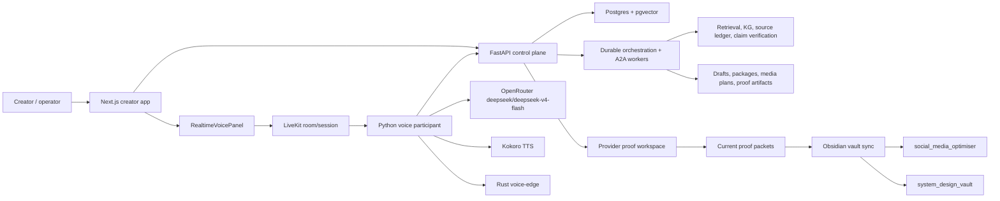

# Agent Studio Project Knowledge Graph

## Read This First

Agent Studio is a local-first, realtime multi-agent content studio for source-backed social content. The creator should be able to speak or type into a Next.js app, get researched drafts, inspect source and claim evidence, package output for social platforms or Substack, and route feedback back into specialist agents. The product app is separate from both Obsidian vaults; the vaults are planning, design, tracking, and memory systems.

Current realtime target: **OpenRouter `deepseek/deepseek-v4-flash` for live-dialogue reasoning, LiveKit for room/media/data-channel transport, Kokoro for spoken output, and Rust voice-edge for VAD/barge-in/cancellation proof**. Treat Gemma, Gamma, Hugging Face, MLX, and older Gemma/Kokoro wording as historical or non-default unless a future route note explicitly re-promotes them with separate proof gates.

Low-context continuation rule: start here, then open only the narrow source pointer needed for the task. Do not replay both vaults. Do not move planning trackers, Kanban state, or design notes into the creator app.

## Current Target Architecture

Core boundary: FastAPI is the durable orchestration/control API, not the media server. LiveKit owns realtime transport. OpenRouter returns text reasoning for live dialogue. Kokoro produces spoken output. Rust voice-edge owns local VAD, barge-in, cancellation, and benchmark evidence. Postgres + pgvector is the product state plane; Obsidian is the planning/memory plane.

## Actors And Agents

| Actor or agent | Owns | Current read |
|---|---|---|
| Creator/operator | Voice/text goals, approvals, credentials, proof inputs, publication decisions | Active user-facing actor |
| Next.js creator app | Conversation, sources, artifact board, activity, production, voice panel | Implemented product surface; not a planning dashboard |
| FastAPI backend | API, SSE/events, provider readiness, proof endpoints, artifact serving, run context | Implemented control plane |
| Postgres + pgvector | Runs, events, checkpoints, turns, sources, claims, artifacts, feedback, memories | Canonical product state; no SQLite |
| A2A worker network | Specialist task routing, retries, context packets, public-safe projection, feedback follow-up | Implemented with scoped caveats |
| Realtime Conversation Host / voice participant | LiveKit session participation, OpenRouter turn calls, Kokoro streaming, durable voice events | Preflight-ready; accepted proof record pending |
| Retrieval Intelligence Agent | Query expansion, retrieval quality ledgers, accepted-source counts, reranker fallback proof | Partially implemented; more evaluation work remains |
| Knowledge Graph Curator | Source/claim/artifact/topic/entity graph coverage and traversal edges | Partially implemented; full graph curation/eval remains |
| Source Ledger + Claim Verification | Accepted/rejected evidence, supported/unsupported claims, publish gating | Implemented and product-visible |
| Guardrails / Publish Readiness | Source, privacy, policy, destination, rollback/postcondition gates | Local/non-live gates strong; external publication still blocked |
| Obsidian memory agents | Raw/wiki/output memory, Codex context, run review notes, memory promotion | Active in `social_media_optimiser` |

## Runtime And Data Flows

| Flow | Data path | Proof boundary |
|---|---|---|
| Creator turn | Creator -> Next.js -> FastAPI -> Postgres events/checkpoints -> workers -> artifacts -> UI | Run/event persistence and public-safe projections |
| Source-backed content | Intent router -> web/retrieval -> KG/source ledger -> claim verification -> writer/editor/guardrails | Accepted evidence before publishable claims |
| Realtime dialogue | Voice panel -> LiveKit -> Python participant -> OpenRouter text reasoning -> Kokoro audio -> LiveKit/UI -> FastAPI events | Same-run provider smoke, timing ledger, process-start, runtime health |
| Barge-in/cancel | UI or VAD -> LiveKit control/data channel -> Python participant -> Rust edge/OpenRouter/Kokoro cancellation | Correlated run/session/response cancellation evidence |
| Feedback loop | Human feedback -> feedback routing -> owner agents -> revision/hold/accept records -> memory proposals | Typed feedback and memory-policy checks |
| Publication | Distribution package -> publish readiness -> external destination credential/proof -> rollback/postcondition evidence | Accepted external publication proof record |
| Vault sync | Product/state proof packets -> generated Markdown/HTML/JSON -> Obsidian notes | Vaults are source/projection memory, not product state |

## Proof Gates

| Gate | Current status | What remains |
|---|---|---|
| Live voice operator inputs | Current 2026-05-23 status says OpenRouter key file, LiveKit URL, LiveKit key file, and LiveKit secret file are configured; no live-voice operator-input blockers | Do not reopen Hugging Face/Gamma/Gemma/MLX setup for this target |
| Live voice preflight | `voice-runtime-readiness.preflight.json` summary says ready for OpenRouter/Kokoro LiveKit sessions; `provider-backed-live-voice-proof.preflight-validation.json` is `valid_preflight_artifacts` | Capture, validate, record, and recheck an accepted same-run provider-backed live voice proof |
| Live provider smoke | `provider-smoke-ledger.live-openrouter.json` passes with `execute_live_calls=true`, selected session `ebd43531-86e3-4af1-ade0-15ac8d7184bf`, OpenRouter first text delta at 1111.171 ms, Kokoro first audio chunk at 4946.351 ms, and first-audio latency at 6057.54 ms | Use as runtime evidence, but do not treat it as accepted proof until full timing and proof-record capture pass |
| Live voice accepted record | Latest record outcome is `failed`; current completion status is `blocked_by_latest_failed_proof_record` | Accepted record must link process-start, runtime-health, provider-smoke, LiveKit/session, timing-ledger, validation, and workspace-validation evidence |
| Realtime timing ledger | `realtime-voice-timing-ledger.json` is `needs_more_evidence`; 4/8 stages are measured: LiveKit session ready, response start, first text, and first audio | Capture audio-track bridge, speech start, end-of-turn to agent-turn, and barge-in stop evidence |
| External publication inputs | Blocked on LinkedIn credential, policy/account-permission acknowledgement, durable external destination URL/platform ID, and rollback/postcondition evidence | Supply real external destination proof and accepted publication record |
| Completion status | `completion-status.json` is `blocked_by_latest_failed_proof_record`; latest failed proofs are live voice and external publication | Rerun completion status after accepted records for both required proofs |
| Closure review | Template/status blocked by completion status; blocker-state update blocked by closure review | Reviewer approval, closure review recording, then blocker-state update; no command currently claims objective complete |

## Dependencies And Config

Current default realtime dependency set:

- `OPENROUTER_API_KEY_FILE`: readable local secret-file path; content must never be emitted.
- `OPENROUTER_LIVEKIT_URL`: `ws` or `wss` LiveKit URL for OpenRouter-backed dialogue.
- `LIVEKIT_API_KEY_FILE` and `LIVEKIT_API_SECRET_FILE`: readable local secret-file paths; contents must never be emitted.
- Kokoro local package/runtime for spoken output.
- Rust voice-edge binary/service for VAD, barge-in, cancellation, and benchmark evidence.
- FastAPI backend event sink for direct durable voice-agent events.
- Postgres + pgvector for durable product state.

Publication dependency set still blocked:

- `LINKEDIN_ACCESS_TOKEN_FILE`.
- `LINKEDIN_POLICY_ACKNOWLEDGEMENT_ARTIFACT_ID`.
- `PUBLICATION_DURABLE_PLATFORM_ID_OR_URL`.
- `PUBLICATION_ROLLBACK_OR_POSTCONDITION_ARTIFACT_ID`.

Legacy/non-default dependency lane:

- Local MLX servers on `:8080` or `:8090`.
- `GEMMA4_MULTIMODAL_ENDPOINT_URL`.
- Hugging Face/Gemma/Gamma native-audio paths.
- Raw browser PCM WebSockets as production transport.

## Completed Evidence

- Next.js creator workflow with conversation, draft/artifact, source, activity, production, and voice panels.
- FastAPI APIs for orchestration, event streams, run context, provider readiness, proof workspaces, and generated viewers.
- Postgres + pgvector durable state contract.
- A2A-style local worker network, public projection discovery, scoped retries, and redacted event projections.
- Retrieval/source/claim ledgers with accepted-evidence routing into writers, editors, claim verification, and publish readiness.
- Vault-first planning system in `social_media_optimiser` with MOC, HLD/LLD, current sprint, decision/proof notes, raw/wiki/output memory, and generated HTML/JSON inspection surfaces.
- System-design HLD/LLD and release-gate canon in `system_design_vault`.
- Runtime health and proof workspace infrastructure for provider-backed live voice and publication proof.
- OpenRouter LiveKit readiness implementation: OpenRouter chat-completions readiness is distinct from legacy native-audio checks and does not require `GEMMA4_MULTIMODAL_ENDPOINT_URL`.
- Current proof workspace run `190ae2f9-a74b-4a23-b39c-aaf2d636bd8e` has refreshed 2026-05-23 status packets showing live-voice preflight ready and external publication still blocked.
- Current live provider smoke for that run passes for OpenRouter `deepseek/deepseek-v4-flash` plus Kokoro `hexgrad/Kokoro-82M`, with first text/audio latency evidence recorded in `provider-smoke-ledger.live-openrouter.json`.

## Remaining Implementation And Proof Work

- Capture accepted same-run live voice proof for the OpenRouter DeepSeek + LiveKit + Kokoro path.
- Capture the missing realtime timing stages: audio-track bridge, speech start, turn correlation, and barge-in stop.
- Ensure the accepted live voice record includes managed voice-agent process start, runtime health, provider smoke, realtime timing ledger, LiveKit/session linkage, workspace validation, preflight validation, and no-secret checks.
- Supply real LinkedIn/external publication inputs, run publication proof capture, and record an accepted external publication proof.
- Recheck `provider-proof-completion-status` after accepted proof records.
- Prepare and record closure review only after completion status reaches accepted required proofs.
- Record blocker-state update only after closure review allows it.
- Continue retrieval intelligence and KG curation work: fuller graph curation/evaluation, retrieval-quality decision output into Obsidian, and broader graph coverage checks.
- Keep generated HTML/JSON viewers aligned with Markdown and current matrices without treating them as source truth.

## Blockers And Decisions

Decisions:

- OpenRouter `deepseek/deepseek-v4-flash` + LiveKit + Kokoro is the current realtime backend dialogue target.
- Missing Hugging Face, Gemma, Gamma, MLX, or `GEMMA4_MULTIMODAL_ENDPOINT_URL` must not block current live-dialogue work.
- The creator app stays a product cockpit, not a project-management or Obsidian planning surface.
- Publication is a governed external side effect and cannot be proven by local fixtures, drafts, previews, or internal URLs.
- Proof artifacts must be no-secret: no token values, API keys, raw provider responses, or private audio.

Blockers:

- Latest live voice and external publication proof records are failed, so completion remains blocked even though live-voice preflight is ready.
- External publication still lacks real LinkedIn credential/path, policy acknowledgement, durable destination, and rollback/postcondition evidence.
- Closure review and blocker-state update are downstream of accepted proof records and cannot run honestly yet.

Resolved drift:

- `social_media_optimiser/output/provider-proof/190ae2f9-a74b-4a23-b39c-aaf2d636bd8e/README.md`, `current-proof-status.md`, `operator-unblocker-checklist.md`, `current-blocker-matrix.json`, the proof-readiness HTML, OpenRouter voice boundary HTML, and system-design viewer now agree that live-voice operator inputs are configured for OpenRouter + LiveKit. The aggregate operator-input status is still blocked because external publication inputs remain blocked.
- Frontend and static/browser regression tests were updated so live-voice proof packets no longer expect `HF_TOKEN_FILE`, `GEMMA4_MULTIMODAL_ENDPOINT_URL`, or same-run Gemma audio evidence as current blockers.

Latest verification snapshot:

- `npm run test:race` in `frontend/next-app`: 251/251 passed after OpenRouter/Kokoro wording updates.
- `uv run pytest tests/test_foundation.py -q`: 22/22 passed.
- Focused proof-packet CLI checks for the current UUID operator readiness/checklist: 2/2 passed.
- Browser-rendered verification was intentionally not run in this continuation because Codex/Chrome input automation had just been suspended after a repeated-key/keyboard-layout incident.

## Source Map

Read in this order for future work:

| Source | Vault | Use for |
|---|---|---|
| `system_design_vault/07-agent-studio-knowledge-graph/Agent Studio Project Knowledge Graph.md` | system design | Compact handoff and current KG |
| `system_design_vault/07-agent-studio-knowledge-graph/Agent Studio Knowledge Graph.excalidraw.md` | system design | Visual architecture/proof graph |
| `social_media_optimiser/wiki/ops/active-codex-context.md` | project memory | Current status, coordination notes, proof handoff |
| `social_media_optimiser/01-work-tracking/Current Sprint.md` | project memory | Latest completed work and current focus |
| `social_media_optimiser/01-work-tracking/Agent Studio Objective Completion Audit.md` | project memory | Objective-level evidence and remaining proof boundary |
| `social_media_optimiser/output/provider-proof/190ae2f9-a74b-4a23-b39c-aaf2d636bd8e/current-proof-status.md` | project memory | Current proof gate and no-secret operator summary |
| `social_media_optimiser/output/provider-proof/190ae2f9-a74b-4a23-b39c-aaf2d636bd8e/current-blocker-matrix.json` | project memory | Machine-readable blocker matrix |
| `social_media_optimiser/output/provider-proof/190ae2f9-a74b-4a23-b39c-aaf2d636bd8e/completion-status.json` | project memory | Current completion status |
| `social_media_optimiser/output/provider-proof/190ae2f9-a74b-4a23-b39c-aaf2d636bd8e/voice-runtime-readiness.preflight.json` | project memory | Live voice runtime readiness summary |
| `social_media_optimiser/output/provider-proof/190ae2f9-a74b-4a23-b39c-aaf2d636bd8e/provider-backed-live-voice-proof.preflight-validation.json` | project memory | Live voice preflight validation status |
| `social_media_optimiser/output/provider-proof/190ae2f9-a74b-4a23-b39c-aaf2d636bd8e/provider-smoke-ledger.live-openrouter.json` | project memory | Current OpenRouter/Kokoro live-smoke evidence |
| `social_media_optimiser/output/provider-proof/190ae2f9-a74b-4a23-b39c-aaf2d636bd8e/realtime-voice-timing-ledger.json` | project memory | Remaining timing-stage proof gaps |
| `social_media_optimiser/00-system-design/HLD - Agent Studio.md` | project memory | Product HLD |
| `social_media_optimiser/00-system-design/LLD - Agent Studio.md` | project memory | Product LLD |
| `social_media_optimiser/00-system-design/Agent Roster and Responsibilities.md` | project memory | Agent roles and ownership |
| `social_media_optimiser/02-research/Retrieval Intelligence and Knowledge Graph Research.md` | project memory | Retrieval/KG implementation and remaining work |
| `system_design_vault/04-agent-studio-implications/HLD - Agent Studio System Design.md` | system design | Deep HLD and architecture canon projection |
| `system_design_vault/04-agent-studio-implications/LLD - Agent Studio System Design.md` | system design | Runtime contracts, voice timing, provider interfaces |
| `system_design_vault/04-agent-studio-implications/Datastore Schema - Agent Studio Source and Route Ledger.md` | system design | Durable schema concepts |
| `system_design_vault/03-patterns/system-design/production-agent-studio-canon.md` | system design | Release-gate and production architecture canon |
| `system_design_vault/03-patterns/inference/realtime-and-inference-patterns.md` | system design | Realtime/provider route patterns |
| `system_design_vault/03-patterns/retrieval/reranking-search-kg-patterns.md` | system design | Retrieval/reranking/KG patterns |

Runtime/code landmarks for product work only, not for this vault-only handoff:

- `frontend/next-app/components/voice/RealtimeVoicePanel.tsx`
- `frontend/next-app/app/page.tsx`
- `frontend/next-app/lib/api/client.ts`
- `src/all_about_llms/app.py`
- `src/all_about_llms/storage/postgres.py`
- `src/all_about_llms/orchestration/`
- `src/all_about_llms/providers/realtime.py`
- `src/all_about_llms/voice_agent/`
- `services/voice-edge/`

## Agent Resume Checklist

- Confirm whether the task is vault work or product-app work before editing.
- For vault work, keep edits in the requested vault section unless explicitly told otherwise.
- For product work, preserve the boundary: planning trackers and Obsidian notes do not become app UI.
- Check `current-proof-status.md`, `completion-status.json`, and the current matrix before claiming proof completion.
- Use OpenRouter/LiveKit/Kokoro as the active realtime default.
- Treat publication as a governed side effect requiring real external destination and rollback evidence.
- Keep proof packets no-secret.
- Update generated outputs only when requested or when a source/projection refresh is the task.

## Sidecar Audit 2026-05-23

This directory now has the minimum compact KG handoff expected by a separate worker: current realtime path, proof gates, product/planning boundary, done/left split, and source pointers are present in this note. The only structural gap found in this folder was the missing Excalidraw artifact referenced by `README.md`; it has been added as `Agent Studio Knowledge Graph.excalidraw.md`.

Audit read:

- `system_design_vault/07-agent-studio-knowledge-graph/README.md`
- `system_design_vault/07-agent-studio-knowledge-graph/Agent Studio Project Knowledge Graph.md`
- `social_media_optimiser/wiki/ops/active-codex-context.md`
- `social_media_optimiser/wiki/ops/codex-obsidian-working-memory.md`
- `social_media_optimiser/wiki/ops/autonomous-obsidian-ingestion-flow.md`

Main-agent cleanup watchlist, outside this sidecar write scope:

- Older system-design notes may still mention Gemma/Gamma/Hugging Face/MLX as active voice setup dependencies. They should be treated as legacy/non-default unless a route note re-promotes them with separate proof gates.
- The proof source map points to product proof JSON, tests, and generated viewers that this sidecar intentionally did not touch. Main agent should refresh those only from the product/proof workflow.

## Diagram

See `Agent Studio Knowledge Graph.excalidraw.md` in this folder.
