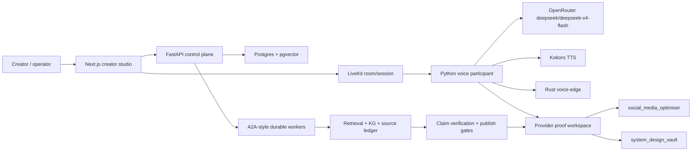

# Agent Studio Sidecar Pickup - 2026-05-24

## Read This First

This note is a compact pickup artifact for future LLMs. It synthesizes the two Obsidian vaults without rewriting their existing sections. It should reduce context load, not replace the source notes.

Social/project mirror: `../../social_media_optimiser/wiki/ops/sidecar-vault-pickup-2026-05-24.md`

Diagram: `Agent Studio Sidecar Pickup 2026-05-24.excalidraw.md`

## Current System Intent

Build Agent Studio: a local-first, realtime, long-running multi-agent content studio for source-backed social content and Substack-style artifacts. The user should be able to speak or type a goal, let specialist agents research and draft, inspect source/claim evidence, package outputs, request revisions, and eventually publish through governed external-platform proof.

Boundary that must stay intact:

- Product app: creator workflow in Next.js.
- Control plane: FastAPI APIs, events, proof routes, context packets.
- Durable product state: Postgres + pgvector only.
- Realtime media and dialogue: LiveKit + Python voice participant + OpenRouter + Kokoro + Rust voice-edge.
- Planning/design/memory: `social_media_optimiser/` and `system_design_vault/`.
- Companion projections: generated HTML/JSON are inspection surfaces, not source truth.

## Knowledge Graph

Key relationships:

- The app never owns model calls or durable state directly; it talks to FastAPI and LiveKit.
- FastAPI is a control plane, not a media server.
- LiveKit owns media/data-channel transport.
- OpenRouter returns text reasoning for live dialogue; Kokoro turns it into speech.
- Rust voice-edge owns VAD, barge-in, cancellation acknowledgement, and benchmark evidence.
- Postgres + pgvector is canonical product memory; Obsidian is project/design memory.
- Source-backed content must pass retrieval, source-ledger, claim, guardrail, and feedback gates before publish-readiness.

## Active Defaults And Legacy Lanes

Active default:

- OpenRouter `deepseek/deepseek-v4-flash` for live dialogue reasoning.
- LiveKit for realtime room/media/data-channel transport.
- Kokoro `hexgrad/Kokoro-82M` for spoken output.
- Rust voice-edge for local VAD, barge-in, cancellation, and latency/quality proof.

Legacy or non-default unless explicitly re-promoted:

- Gemma/Gamma/Hugging Face/MLX native-audio or local endpoint paths.
- `GEMMA4_MULTIMODAL_ENDPOINT_URL`.
- Raw browser PCM WebSockets as production voice transport.
- Local MLX servers on `:8080` or `:8090` as current blockers.

## Implemented Surface

- Next.js creator app with conversation, voice panel, artifacts, source/draft review, activity, feedback, package/media/publish-readiness controls, and run restore.
- FastAPI backend with run APIs, event streams, provider/readiness/proof endpoints, A2A interfaces, artifact serving, context packets, and generated viewers.
- Postgres + pgvector durable state for runs, events, checkpoints, A2A messages, sources, claims, artifacts, feedback, memories, retrieval ledgers, and realtime sessions.
- Local A2A-style worker network with agent roster, specialist skill ownership, public-safe projections, retry/recovery paths, and event redaction.
- Retrieval Intelligence and Knowledge Graph Curator as explicit workers with retrieval-quality ledgers and source/claim/artifact graph responsibilities.
- Source ledger, claim verification, publish-readiness, guardrails, revision plans, feedback routing, and memory-promotion flows.
- Obsidian-first planning in `social_media_optimiser` and deep system-design source ingestion in `system_design_vault`.
- Provider-proof workspace for run `190ae2f9-a74b-4a23-b39c-aaf2d636bd8e`, including current matrix/status/checklist, proof plan, templates, validation reports, accepted live-voice proof, failed publication proof, and no-secret operator packets.
- OpenRouter + LiveKit + Kokoro preflight, smoke, timing, and accepted proof evidence, including measured first text/audio latency plus 8/8 realtime timing stages.

## Remaining Work

- Capture an accepted external publication proof with LinkedIn credential/path, policy acknowledgement, durable external destination, and rollback/postcondition evidence.
- Rerun completion status after external publication proof is accepted.
- Run closure-review template, validation, recording, closure status, and blocker-state update only after accepted proof completion status allows it.
- Continue retrieval/KG curation: broader graph coverage, evaluation, missed-source audits, and Obsidian-native retrieval-quality review outputs.
- Improve Rust voice-edge toward benchmarked concurrent-session tuning and a LiveKit-side media bridge.
- Keep system-design source ingestion focused on gaps that affect current blockers: realtime speech ops, provider smoke, publication governance, observability, and release gates.

## Proof Gate Snapshot

Current run: `190ae2f9-a74b-4a23-b39c-aaf2d636bd8e`

Status:

- `completion-status.json`: `blocked_by_latest_failed_proof_record`.
- Accepted proofs: `provider-backed-live-voice-proof`.
- Latest failed proofs: `external-publication-proof`.
- State-change allowed: false.
- Goal completion claimed: false.

Live voice:

- Operator inputs are configured for OpenRouter and LiveKit file/URL fields.
- Preflight validation is valid for the current route.
- Provider smoke has live OpenRouter/Kokoro evidence.
- Timing ledger is `ready` with 8/8 stages measured.
- Accepted proof record is available and validated.

External publication:

- Local/non-live publication fixture and source/guardrail evidence exist.
- The proof remains blocked by missing LinkedIn credential/path, policy acknowledgement, durable destination, and rollback/postcondition evidence.
- Accepted proof record is not available.
- Committed no-secret operator runbook: `docs/external-publication-proof-runbook.md`; generated detailed packet remains `social_media_optimiser/output/provider-proof/190ae2f9-a74b-4a23-b39c-aaf2d636bd8e/operator-unblocker-checklist.md`.
- Required operator inputs remain `LINKEDIN_ACCESS_TOKEN_FILE`, `LINKEDIN_POLICY_ACKNOWLEDGEMENT_ARTIFACT_ID`, `PUBLICATION_DURABLE_PLATFORM_ID_OR_URL`, and `PUBLICATION_ROLLBACK_OR_POSTCONDITION_ARTIFACT_ID`.

Closeout:

- Completion-status recheck comes after record capture/validation/recording.
- Closure review is blocked until completion status reaches accepted required proofs.
- Blocker-state update is blocked until closure review passes.

## CI And PR Workflow

The vaults mostly record validation evidence and proof discipline. The repository workflow files add the PR/CI mechanics:

- Branches: `feature/<short-name>` for feature work and `fix_<timestamp-or-uuid>` for fixes.
- Parallel agents should use disjoint worktrees and file scopes.
- Local pre-PR checks: ruff, stable Python CI slice, frontend build/lint/typecheck/test:race, Rust checks for Rust changes, and broader pytest when feasible.
- CI jobs: branch-name policy, Python backend, Next.js frontend, Rust services, and optional/manual or main-only live Postgres integration.
- Python CI dependency sync uses `uv sync --locked`, guarded by `tests/test_repo_workflow_ci.py`, so the workflow installs from committed `uv.lock`; local command logs remain ignored.
- PR checklist requires verification evidence, no secrets/artifacts, green CI, and approved review before auto-merge.
- If GitHub PR creation is blocked by integration permissions, run `uv run all-about-llms-admin provider-proof-pr-handoff --run-id 190ae2f9-a74b-4a23-b39c-aaf2d636bd8e --operator-input-path social_media_optimiser/output/provider-proof/190ae2f9-a74b-4a23-b39c-aaf2d636bd8e/operator-inputs.template.env --ci-url <latest-branch-head-ci-url> --head-sha <current-branch-head-sha>` and paste the generated no-secret body into a manual PR after filling the placeholders from the current branch head. This preserves provider-proof gate state, current OpenRouter/LiveKit/Kokoro routing, CI evidence, and LinkedIn operator blockers without exposing secret values.
- Branch protection, required status checks, CODEOWNERS/review, and auto-merge settings still need repository-level enforcement outside files.

## Source Attribution

| Claim area | Primary project-vault source | Primary system-design source |
|---|---|---|
| Product purpose and boundary | `social_media_optimiser/00-system-design/HLD - Agent Studio.md` | `system_design_vault/04-agent-studio-implications/HLD - Agent Studio System Design.md` |
| Runtime modules and voice contract | `social_media_optimiser/00-system-design/LLD - Agent Studio.md` | `system_design_vault/04-agent-studio-implications/LLD - Agent Studio System Design.md` |
| Current proof status | `social_media_optimiser/output/provider-proof/190ae2f9-a74b-4a23-b39c-aaf2d636bd8e/current-proof-status.md` | `system_design_vault/04-agent-studio-implications/agent-studio-objective-completion-audit.md` |
| Done/left objective status | `social_media_optimiser/01-work-tracking/Agent Studio Objective Completion Audit.md` | `system_design_vault/07-agent-studio-knowledge-graph/Agent Studio Project Knowledge Graph.md` |
| Current model/provider direction | `social_media_optimiser/wiki/ops/active-codex-context.md` | `system_design_vault/MOC.md` |
| Work tracking and validation evidence | `social_media_optimiser/01-work-tracking/Current Sprint.md` | `system_design_vault/04-agent-studio-implications/agent-studio-objective-completion-audit.md` |
| Durable decisions | `social_media_optimiser/01-work-tracking/Decision Log.md` | `system_design_vault/04-agent-studio-implications/HLD - Agent Studio System Design.md` |
| Source-ingestion scope | `social_media_optimiser/Agent Studio MOC.md` | `system_design_vault/05-ingestion-runs/status-summary.md` |

Read-only non-vault workflow sources used for CI/PR summary:

- `docs/repo-workflow.md`
- `.github/pull_request_template.md`
- `.github/workflows/ci.yml`

## Future LLM Operating Rules

- Start from this note plus the current proof status before loading broad vault context.
- Do not reopen Gemma/Gamma/Hugging Face/MLX as current live-dialogue blockers.
- Do not claim completion from preflight, credentials, provider smoke, or local rehearsal.
- Do not print secret values or raw provider/audio payloads.
- Keep Obsidian planning/tracking out of the product app.
- Treat HTML/JSON viewers as projections; update source Markdown or generated artifacts through their owning workflow.
- Before editing, check dirty files because Cursor and other agents may be working concurrently.
